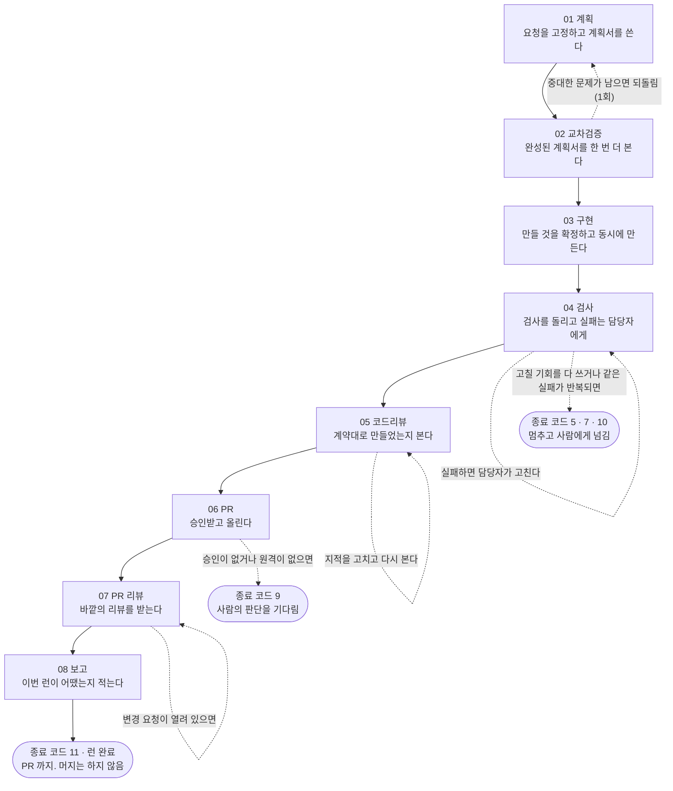

# harness-template

**개발 요청 하나를 계획서 작성부터 PR 생성까지 정해진 순서로 끌고 가는 개발 하네스
템플릿입니다.** 이 저장소를 복사해 쓰면, `/feature <요청>` 한 번으로 아래 흐름이 돌아갑니다.

계획서 작성 → 다른 LLM이 그 계획을 검토 → 만들 것 목록 확정 → 구현 →
테스트·린트 검사 → 코드 리뷰 → PR 생성 → 결과 보고

요청을 받자마자 코드를 쓰지 않는 것이 핵심입니다. 단계마다 실행기가 "다음에 무엇을 하라"를
지시하고, 나온 결과물을 기계로 검사하고, **통과했을 때만 다음 단계로 넘어갑니다.**
검사에 실패하면 정해진 횟수만큼 고쳐 보고, 그래도 안 되면 멈추고 사람에게 넘깁니다.

특징 세 가지입니다.

- 실행기는 **파이썬 표준 라이브러리만** 씁니다. 프로젝트의 패키지 설치가 깨졌거나 빌드가
  안 되는 상태에서도 검사는 그대로 돌아갑니다.
- **어떤 기술 스택에서도 씁니다.** "테스트는 어떤 명령으로 돌리나" 같은 스택별 지식은
  어댑터 파일 한 곳에만 있고, 나머지 코드는 그것을 모릅니다.
- **PR 을 만드는 데까지가 범위입니다. 머지는 하지 않습니다.**

## 먼저 알아둘 말들

이 문서와 코드에서 반복해서 나오는 말들입니다. 뒤로 갈수록 자주 나오니 훑어 두면 편합니다.

| 말 | 뜻 |
|---|---|
| **런**(run) | 요청 하나를 처음부터 PR 까지 끌고 가는 한 번의 작업입니다. 런마다 폴더가 하나 생기고 중간 결과물이 거기 쌓입니다 |
| **페이즈**(phase) | 런을 나눈 8개의 단계입니다. 각 단계가 무엇을 요구하고 무엇을 내놓아야 하는지는 `harness/phases/01~08.md` 에 적혀 있습니다 |
| **계약**(contract) | 이번에 만들 함수와 API 를 미리 적어 둔 목록 문서입니다. 구현을 시작하기 전에 확정하고, 이후의 모든 검사가 이 문서를 기준으로 삼습니다 |
| **유닛 / 진입점** | 계약이 나열하는 함수 하나가 유닛이고, 바깥에서 호출하는 입구(API 경로 등)가 진입점입니다 |
| **어댑터**(adapter) | "이 스택에서 타입 검사는 이 명령, 테스트는 저 명령" 을 적어 둔 JSON 파일입니다. 스택을 바꿀 때는 이것만 갈아 끼웁니다 |
| **스테이지**(stage) | 검사 한 종류입니다. 이름 8개(컴파일·린트·의존성 점검·부분 테스트·전체 테스트·E2E·빌드·문서)는 정해져 있고, 실제로 실행할 명령은 어댑터가 정합니다 |
| **게이트**(gate) | 통과하지 못하면 다음 단계로 못 가게 막는 검사입니다 |
| **역할**(role)**과 소유 경계** | 구현 담당·테스트 담당처럼 나눈 작업자와, 각자 건드려도 되는 파일 범위입니다. 남의 범위를 건드리면 검사에서 걸립니다 |
| **귀속**(attribution) | 테스트가 깨졌을 때 구현 담당의 잘못인지 테스트 담당의 잘못인지를 실행기가 가려내는 일입니다. 관계없는 사람에게 수리를 시키지 않으려고 합니다 |
| **봉투**(envelope) | 실행기가 화면에 출력하는 JSON 한 덩어리입니다. "지금 무엇을 하라"와 "다음에 칠 명령"이 여기 들어 있습니다 |
| **원장**(ledger) | 리뷰에서 나온 지적을 계속 쌓아 두는 기록 파일입니다. 이미 쓴 줄을 고치지 않고 뒤에 덧붙이기만 합니다 |
| **승격**(promote) | 여러 번 반복된 지적을 린트 규칙 같은 자동 검사로 올리는 일입니다. 같은 말을 사람이 계속 반복하지 않게 만듭니다 |
| **캘리브레이션**(calibration) | 각 검사가 실제로 몇 초 걸리는지 한 번 재 두는 일입니다. 타임아웃 같은 값이 여기서 나옵니다 |
| **에스컬레이션**(escalation) | 자동으로 풀 수 없을 때 진행을 멈추고 사람에게 넘기는 일입니다 |
| **`PASS_WITH_GAPS`** | "통과는 했지만 돌리지 못한 검사가 있다" 는 뜻의 결과 등급입니다 |

## 시작하기 전에 알아둘 것 세 가지

오해하기 쉬운 것들이라 먼저 적습니다.

1. **`CLAUDE.md` 에 적은 규칙은 자동으로 프롬프트에 들어가지 않습니다.**
   파이프라인은 `harness/config.json` 과 `harness/phases/03-implement.md` 에서
   "이 파일을 읽어라" 라고 가리킬 뿐입니다. 예전에 그 내용을 통째로 실어 주던 실행기는
   이 템플릿에 들어 있지 않습니다. 그래서 **규칙은 작업자가 실제로 읽어야 지켜집니다.**
   읽지 않은 채로 지켰다고 보고하는 것을 이 저장소는 가장 나쁜 실패로 봅니다
   ([ROADMAP](docs/harness/ROADMAP.md) §4).
2. **예전의 순차 실행기 `scripts/execute.py` 는 들어 있지 않습니다.** 권한 승인을 건너뛴 채
   모델을 돌리는 방식이어서, 이 템플릿을 복사해 쓰는 사람이 그것까지 물려받지 않도록
   뺐습니다 ([DECISIONS](docs/harness/DECISIONS.md) ADR-H005 · ADR-H037).
3. **아직 확인되지 않은 부분이 있습니다.** 무엇이 실제로 검증됐고 무엇이 아직인지는
   [ROADMAP](docs/harness/ROADMAP.md) §6 이 표로 정리해 둡니다. 동봉된 어댑터의 `verified`
   값과 `harness/calibration.json` 은 아직 "확인 전" 쪽입니다.

## 빠른 시작


### 1. 복사한 다음, 문서부터 채웁니다

`CLAUDE.md` 의 빈칸과 `docs/` 아래 7개 문서(`PRD` · `TRD` · `API_SPEC` · `ARCHITECTURE` ·
`ADR` · `UI_GUIDE` · `PIPELINE-LOG`)는 내용 없는 골격 상태로 배포됩니다.
**이 문서들이 하네스 설정의 재료라서, 순서를 바꾸면 설정에서 채울 수 없는 칸이 생깁니다.**

| 하네스가 알아야 하는 것 | 어느 문서에서 가져오나 |
|---|---|
| 어떤 어댑터를 쓸지 (빌드·테스트 명령이 무엇인지) | `docs/TRD.md` 의 기술 스택 |
| 무엇을 만드는지 (계약에 적을 함수와 진입점) | `docs/PRD.md` 의 유저 스토리와 기능 요구사항 |
| 담당자별로 어느 폴더를 맡는지 | `docs/ARCHITECTURE.md` 의 디렉토리 구조와 레이어 |
| 검사가 무엇을 봐야 하는지 | `CLAUDE.md` 의 CRITICAL 규칙 |
| 성능·보안의 기준선 | `docs/TRD.md` 의 비기능 요구사항 |

### 2. 설정 파일을 만듭니다

준비된 시드를 복사해 `harness/config.json` 을 만듭니다.

```
python scripts/harness.py init --adapter nextjs-ts --name my-project
```

### 3. `doctor` 를 통과시킵니다

설정과 실제 저장소가 어긋난 곳을 실행 전에 찾아 주는 명령입니다.

```
python scripts/pipeline/cli.py doctor
```

파이썬 버전, 설정 파일 형식, 어댑터가 요구하는 파일의 존재, 실행할 명령어가 실제로 있는지,
담당자별 파일 범위가 서로 겹치지 않는지, 계약 문서의 절 제목이 설정과 같은지, 원격 저장소와
기준 브랜치가 있는지 등을 봅니다.

**여기서 종료 코드 2 가 나오면 거기서 멈추고 FAIL 항목부터 고칩니다.** 경고는 통과시키지만
전부 화면에 남깁니다. 검사를 건너뛴 것은 통과한 것이 아니어서, 건너뛴 항목은 마지막
보고서까지 따라갑니다.

### 4. 한 번 실측합니다

각 검사를 한 번씩 돌려 걸린 시간을 `harness/calibration.json` 에 기록합니다.
타임아웃을 얼마로 잡을지, 전체 테스트를 백그라운드로 돌릴지 같은 값이 여기서 나옵니다.

```
python scripts/harness.py calibrate
```

### 5. `/feature <요청>` 을 칩니다

여기서부터는 파이프라인이 끌고 갑니다.

## 8단계가 어떻게 돌아가나

한 단계에서 오가는 것은 두 번뿐입니다. `next` 를 치면 실행기가 "지금 무엇을 하라"를
알려 주고, 모델이 결과물을 정해진 경로에 쓰고, `record` 를 치면 실행기가 그것을 검사한 뒤
통과하면 다음 단계로 넘겨 줍니다. (4단계는 `record` 대신 `gate`, 8단계는 `report` 로 닫습니다.)

실행기가 화면에 내보내는 것은 **언제나 JSON 한 덩어리**이고, 모델이 그중 읽는 것은
"지금 할 일"과 "다음에 칠 명령" 두 가지뿐입니다.



| 단계 | 무엇을 하나 | 무엇이 나오나 | 언제 통과하고 언제 멈추나 |
|---|---|---|---|
| **01 계획** | 사용자의 원본 요청을 그대로 고정해 두고, 그 요청을 빠짐없이 덮는 계획서를 씁니다. 계획의 각 항목에는 요청 원문에서 그대로 따온 문장을 근거로 붙입니다 | 계획서와 회차별 검토 기록 | 붙인 근거가 실제로 요청 원문에 있는 문장인지, 요청의 모든 항목이 정확히 한 번씩 계획에 덮였는지를 봅니다. 몇 번을 고쳐도 합의가 안 되면 멈추고 사람에게 넘깁니다 |
| **02 교차검증** | 완성된 계획서 전체를 다른 검토자가 한 번 더 봅니다. 01 의 검토는 매번 그때까지 쓰인 계획만 봤고, 완성본을 통째로 본 적이 없기 때문입니다 | 검토 결과 JSON | 중대한 문제가 0건이어야 넘어갑니다. 남으면 01 로 한 번 되돌립니다. 검토자를 아예 쓸 수 없는 환경이면 이 단계를 건너뛰되, 결과 등급을 `PASS_WITH_GAPS` 로 낮춥니다 |
| **03 구현** | 이번에 만들 함수와 진입점 목록(계약)을 먼저 확정하고, 담당자들이 **동시에** 각자 맡은 폴더를 채웁니다. 만들 것을 미리 못 박아 두기 때문에, 구현과 테스트를 같이 만들어도 서로를 보고 형태를 맞추는 일이 생기지 않습니다 | 계약 문서와 담당자별 작업 목록 | 남의 폴더를 건드린 파일이나 주인 없는 파일이 없어야 하고, 컴파일·타입 검사를 통과해야 합니다 |
| **04 검사** | 어댑터에 적힌 검사들을 순서대로 돌리고, 실패가 나오면 그것이 누구의 몫인지 가려내 그 담당자에게만 되돌립니다 | 검사 결과와 귀속 결과 | 고칠 기회는 3번입니다. 기회가 남아 있어도 **같은 사람이 같은 실패를 두 번 내면** 거기서 멈추고 사람에게 넘깁니다. 테스트가 0개인 것은 막지 않고 기록만 하지만, 있던 테스트 수가 크게 줄면 막습니다 |
| **05 코드리뷰** | 04 가 "돌아가는가" 를 봤다면 05 는 "계약대로 만들었는가, 그리고 봐야 할 사람이 실제로 봤는가" 를 봅니다. 돈이 안 드는 검사부터 하고, 변경된 파일에 해당하는 리뷰어만 골라 동시에 부릅니다 | 계약 대조 결과, 리뷰 결과, 승격 후보 | 고치고 다시 보는 것은 2번까지입니다. 리뷰어가 전부 실패했거나 부를 리뷰어가 한 명도 없었으면 결과 등급이 `PASS_WITH_GAPS` 로 내려갑니다 |
| **06 PR** | "이걸 밖으로 내보내도 되는가" 를 확인합니다. 승인을 받아 기록으로 남기고, 계약 문서를 지운 뒤 원격에 올리고, PR 본문을 만듭니다. 실제 PR 생성은 메인 세션이 GitHub 도구로 합니다 | PR 본문과 PR 생성 요청서 | 승인이 없으면 종료 코드 9 로 정상 종료하고 사람을 기다립니다. 승인 후에 코드가 바뀌면 다시 승인받습니다. 원격과 어긋나면 강제로 덮어쓰지 않고 멈춥니다 |
| **07 PR 리뷰** | 05 는 우리가 우리 코드를 본 것이고, 07 은 **바깥에서 온 리뷰**를 받는 단계입니다. 외부 리뷰를 모으고, 원장에 쌓인 지적 중 기준을 넘은 것을 자동 검사 규칙으로 승격합니다 | PR 리뷰 결과와 승격 결과 | 변경 요청이 열려 있으면 멈춥니다. 고치고 다시 보는 것은 2번까지입니다 |
| **08 보고** | 이번 런이 어땠는지 적는 단계입니다. 숫자 표는 실행기가 기록에서 그대로 조립하고, 무엇이 문제였고 어떻게 풀었는지는 모델이 씁니다. 이 단계는 코드도 diff 도 보지 않습니다 | `docs/harness/pipeline/runs/` 아래 보고서 | 보고서가 부실해도 파이프라인을 실패시키지는 않습니다. 다만 **돌리지 못한 검사가 조용히 통과한 것처럼 보이는 것**은 막습니다 |

## 어떤 파일이 무엇을 하나

### `harness/` — 설정과 선언

| 경로 | 무엇 |
|---|---|
| `config.json` | 이 프로젝트의 설정 하나입니다. 어떤 어댑터를 쓸지, 담당자와 각자의 파일 범위, 계약 문서의 절 제목, 리뷰어를 언제 부를지, 한 런에서 쓸 수 있는 예산(파일 수·줄 수·모델 호출 수), 브랜치 규칙이 들어갑니다 |
| `config.schema.json` | 위 파일의 형식 정의입니다. 검사기는 표준 라이브러리로 직접 만들었고, `_` 로 시작하는 키는 주석으로 보고 건너뜁니다 |
| `adapters/*.json` | 스택별 명령 모음입니다. `self-python`(이 저장소 자신) · `nextjs-ts` · `_template`(새로 만들 때 복사하는 빈 틀) |
| `adapters/adapter.schema.json` | 어댑터의 형식 정의입니다. **실행을 허용하는 명령어 목록이 여기 들어 있습니다** — 실행기 코드에 두지 않습니다 |
| `profiles/<어댑터>/config.json` | `harness.py init` 이 복사해 가는 설정 시드입니다. 프로젝트 이름만 바꿔 넣습니다 |
| `phases/01~08.md` | 각 단계의 정의입니다. 문서 맨 위에 JSON 이 들어 있고, 그 단계가 무엇을 요구하고(`requires`) 무엇을 내야 하고(`produces`) 몇 번까지 다시 시도하는지(`loop`)가 적혀 있습니다 |
| `templates/contract.md` | 계약 문서의 빈 틀입니다. 절 제목은 `config.json` 에 적힌 것과 글자까지 같아야 하고, 다르면 `doctor` 가 미리 막습니다 |
| `calibration.json` | `calibrate` 가 남기는 실측값과 거기서 나온 정책입니다. **"아직 안 재봤다" 와 "0초" 를 같은 칸에 쓰지 않습니다** |

**어댑터는 스택 지식이 다른 코드로 새지 않게 막는 문 하나입니다.** 검사 이름 8개
(`compile` · `lint` · `check` · `scoped` · `full` · `e2e` · `build` · `docs`)는 코어가 고정하고,
그 이름에 붙는 **실제 명령은 어댑터가 정합니다.** 단계 정의 파일은 이름만 부르기 때문에,
스택을 바꿔도 코어 코드는 한 줄도 바뀌지 않습니다. 명령이 `null` 인 검사는 **없는 것**이지
통과한 것이 아니고, 결과에도 그렇게 남습니다.

### `scripts/` — 실행기

| 경로 | 무엇 |
|---|---|
| `harness.py` | 설정을 다루는 명령들입니다 — `init` · `doctor` · `calibrate` |
| `pipeline/cli.py` | 8단계 파이프라인의 입구입니다. 명령을 해석하고, 단계 정의 파일을 읽고, 진입 조건을 따지고, 결과를 JSON 으로 내보냅니다 |
| `pipeline/state.py` | 런 폴더와 진행 상태, 이벤트 기록, 작업 트리의 지문(코드가 그대로인지 확인하는 해시)을 다룹니다. 상태 이름과 등급 이름이 이 파일 하나에서 나옵니다 |
| `pipeline/adapters.py` | 어댑터를 읽고 검사를 실행합니다. 판정하거나 상태를 쓰지는 않습니다 |
| `pipeline/attribution.py` | 실패가 누구 몫인지 가려냅니다. 파일도 프로세스도 건드리지 않는 함수들이라, 실패 상황을 저장해 두었다가 나중에 그대로 재현할 수 있습니다 |
| `pipeline/contract.py` | 계약 문서를 읽고, 어떤 테스트만 돌릴지 골라냅니다. 한국어든 영어든 절 제목이 이 파일에 박혀 있지 않습니다 |
| `pipeline/gate.py` | 04 단계의 본체입니다. 검사를 순서대로 돌리고 결과 등급을 매깁니다. 전체 테스트는 고치기 루프가 끝난 뒤에 한 번만 돌립니다 |
| `pipeline/trace_contract.py` | 계약에 적은 것이 코드에 실제로 있는지 5가지로 대조합니다(구현 누락, 오류 상수 누락, 진입점 누락, 테스트 없는 항목, 계약에 없는 새 함수) |
| `pipeline/review.py` | 변경된 파일을 보고 어떤 리뷰어를 부를지 정합니다. **자기가 쓴 코드를 자기가 리뷰할 수 없다**는 규칙을 여기서 강제합니다 |
| `pipeline/precheck.py` | 05 단계에서 가장 먼저 돌리는 무료 검사입니다. 예산, 브랜치, 기준 브랜치와 얼마나 벌어졌는지, 환경 문제를 봅니다. 모델도 테스트도 부르지 않습니다 |
| `pipeline/mask.py` | 밖으로 나가는 글(PR 본문과 코멘트)에서 비밀값을 가립니다. 내부 기록에는 원문을 남깁니다 |
| `pipeline/pr.py` | 06 단계의 본체입니다. 승인과 push, PR 요청서까지 만듭니다. **GitHub 을 직접 부르지는 않습니다** — 실행기의 손은 git 까지입니다 |
| `pipeline/review07.py` | 07 단계에서 내장 리뷰를 부를지, 얼마나 꼼꼼히 볼지를 정해진 규칙으로 정합니다 |
| `pipeline/ledger.py` | 지적 기록을 읽고 씁니다. **읽고 쓰기만 하고 판단하지 않습니다** |
| `pipeline/promote.py` | 쌓인 지적을 자동 검사 규칙으로 올립니다. 실제로 쓰는 것은 07 단계에서 런당 한 번뿐입니다 |
| `pipeline/report.py` | 08 단계입니다. 표는 실행기가 조립하고 설명은 모델이 씁니다 |
| `pipeline/verdict.py` | 제출물이 조건을 맞췄는지 판정합니다. 요청이 그대로 고정됐는지, 요청 항목을 빠짐없이 덮었는지, 계획이 요청에서 벗어나지 않았는지, 검토가 더 이상 새 지적을 내지 않는 상태인지를 봅니다 |
| `runtime.py` | 시각, 대화 기록 읽기, 출력 인코딩처럼 여러 곳이 함께 쓰는 기본 도구입니다 |
| `session_log.py` | 세션이 끝날 때 훅이 부르는 기록기입니다. **해석은 쓰지 않고 사실만 남깁니다.** 실패해도 세션을 막지 않고, 실패했다는 사실을 기록에 남깁니다 |
| `test_harness.py` · `test_pipeline.py` · `test_runtime.py` | 하네스 자신의 테스트입니다 |
| `fixtures/gate/` | 검사 결과를 재현해 보는 데 쓰는 샘플 데이터입니다 |

### `.claude/` — 명령과 담당자

| 경로 | 무엇 |
|---|---|
| `commands/feature.md` | `/feature` 명령입니다. `doctor` 로 열고, 사용자의 요청을 한 글자도 바꾸지 않고 고정한 다음, 종료 코드에 따라 다음에 무엇을 할지 정합니다 |
| `commands/log.md` | `/log` 명령입니다. 세션 기록에 쌓인 사실을 `docs/PIPELINE-LOG.md` 에 한 줄로 옮깁니다. 기록에 없는 것은 적지 않습니다 |
| `agents/impl-writer.md` · `agents/test-writer.md` | 03 단계가 **동시에** 부르는 구현 담당과 테스트 담당입니다. 각자 자기 폴더만 건드립니다 |
| `agents/plan-reviewer.md` | 01·02 단계가 부르는 검토자입니다. 계획을 직접 고치지 않고 지적만 냅니다 |
| `skills/{data-layer,security,architecture,test-quality,docs}-reviewer/SKILL.md` | 05 단계의 리뷰어 5종입니다(데이터·보안·구조·테스트 품질·문서). 변경된 파일이 각자의 담당 범위에 걸리면 켜집니다. 문서 리뷰어만 소스 변경이 하나도 없는 런에서 켜집니다 |
| `settings.json` | 훅 3개입니다 — 응답이 끝날 때 테스트 실행, 세션이 끝날 때 기록 남기기, 위험한 셸 명령 차단 |

### `docs/`

| 경로 | 무엇 |
|---|---|
| `docs/` 바로 아래 7개 | **프로젝트가 채우는 자리**입니다. 빈 골격으로 배포됩니다 |
| `docs/harness/ROADMAP.md` | 이 템플릿에 무엇이 들어 있는지, 어떤 순서로 시작하는지, **무엇이 검증됐고 무엇이 아직인지** |
| `docs/harness/DECISIONS.md` | 왜 그렇게 만들었는지에 대한 결정 기록입니다 (`ADR-H001`~`ADR-H039`) |
| `docs/harness/PILOT-LOG.md` | 런마다 실제로 잰 값입니다. **추정치는 적지 않고, 재보지 않은 것은 "미측정" 으로 남깁니다** |
| `docs/harness/pipeline/team-spec.md` | **8단계의 원본 명세**입니다. 동작을 바꾸려면 여기부터 고칩니다 |
| `docs/harness/pipeline/ledger/taxonomy.json` | 지적을 분류하는 어휘의 단일 출처입니다 |
| `docs/harness/pipeline/ledger/findings.jsonl` | 지적 기록입니다. 덧붙이기만 해서, 여러 브랜치가 합쳐져도 충돌 없이 합쳐집니다 |
| `docs/harness/pipeline/ledger/rules_changelog.md` | 규칙 승격 이력입니다. `promote` 가 쓰고 사람이 직접 적지 않습니다 |

## 명령어

### `python scripts/harness.py` — 설정을 다룹니다

| 명령 | 하는 일 |
|---|---|
| `init --adapter <이름> --name <프로젝트>` | 시드를 복사해 `harness/config.json` 을 만듭니다. 이미 있으면 `--force` 없이는 덮어쓰지 않습니다 |
| `doctor` | 설정과 저장소가 어긋난 곳을 찾아 사람이 읽는 보고서로 냅니다 |
| `calibrate [--stage <이름>] [--replace]` | 검사를 한 번씩 돌려 걸린 시간을 기록합니다. 하나라도 실패하면 **파일을 쓰지 않습니다** — 코드가 깨진 상태에서 잰 값은 기준이 될 수 없기 때문입니다 |

### `python scripts/pipeline/cli.py` — 파이프라인을 돌립니다

`--help` 가 없습니다. 도움말이 화면으로 나가면 "출력은 JSON 한 덩어리" 라는 약속이 깨지기 때문입니다.

| 명령 | 하는 일 |
|---|---|
| `doctor` | 설정 검사에 더해 파이프라인 쪽 7가지를 봅니다(작업 폴더가 git 에서 제외됐는지, 담당자 정의 파일이 있는지, 단계 정의 파일이 온전한지, 계약 틀이 파싱되는지, 리뷰어 설정이 맞는지, 원격과 기준 브랜치가 있는지, 외부 리뷰 봇 설정이 맞는지) |
| `init --feature <이름> --request-file <경로>` | 런을 만들고, 요청 파일을 한 글자도 바꾸지 않은 채로 고정합니다 |
| `next [--run-id <아이디>]` | 진입 조건을 확인하고 다음에 할 일을 알려 줍니다. 세션이 끊겼을 때 이어서 하는 방법도 이 명령입니다 |
| `record --phase <번호> [--file …] [--reviewer …] [--round n] [--failed]` | 결과물을 검사하고, 통과하면 다음 단계로 넘깁니다 |
| `gate [--phase 04] [--stage <이름>] [--replay <폴더>]` | 검사를 실행하고 결과를 읽어 실패를 담당자에게 배정합니다 |
| `advance --phase <번호>` | 다음 단계로 명시적으로 넘깁니다. 검사 뒤에 코드가 바뀌었으면 막습니다 |
| `retry --phase <번호> --counter <이름> --reason <사유>` | 실패한 단계를 다시 진행 상태로 되돌립니다. **다시 하려면 반드시 이 명령을 거칩니다** |
| `escalate [--reason <사유>]` | 진행을 멈추고 사람에게 넘깁니다. 선택지 세 개(그대로 진행 / 범위 줄이기 / 중단)를 함께 제시합니다 |
| `resume --ack` | 멈춰 둔 것을 푸는 **전용** 명령입니다 |
| `status` | 지금 상태를 보여 줍니다. **언제나 정상 종료합니다** — 상태를 물어보는 것이 실패일 수는 없기 때문입니다 |
| `abandon --reason <사유>` | 런을 명시적으로 닫습니다. 사유가 없으면 기록에서 "그만둔 것" 과 "고장 난 것" 이 구분되지 않습니다 |
| `lint-phases [--dir <경로>]` | 단계 정의 파일이 온전한지 봅니다. **CI 없이도 돌아가는 유일한 검증 장치입니다** |
| `precheck [--scope pr] [--phase 05]` | 예산, 브랜치, 기준 브랜치와의 차이, 환경을 미리 봅니다 |
| `contract-trace [--contract <경로>]` | 계약에 적은 것이 코드에 실제로 있는지 대조합니다 |
| `approve --phase 06 [--auto] [--revoke]` | 승인을 기록으로 남깁니다. 그때의 코드 지문과 결과 등급을 함께 적습니다 |
| `mask --file <입력> --out <출력>` | 밖으로 나갈 글에서 비밀값을 가립니다 |
| `pr` | 06 단계의 여섯 과정을 싼 것부터 돌리고 처음 실패한 곳에서 멈춥니다 |
| `promote --scan / --stage / --apply / --flush` | 기록을 다시 세고, 후보를 담고, 실제로 규칙을 쓰고, 남은 것을 정리합니다 |
| `review07 [--external <경로>]` | 07 단계에서 리뷰를 부를지와 얼마나 꼼꼼히 볼지를 정합니다 |
| `report [--out <경로>]` | 08 단계 보고서를 조립합니다 |
| `cost` | 이번 런에 든 비용을 기록에서 모아 계산합니다 |

### 종료 코드

명령이 끝날 때 남기는 숫자입니다. `/feature` 는 이 숫자를 보고 다음에 무엇을 할지 정합니다.

| 코드 | 뜻 | 코드 | 뜻 |
|---|---|---|---|
| `0` | 성공 | `6` | 검사 이후 코드가 바뀌어 넘길 수 없음 |
| `1` | 내부 오류 | `7` | 다시 시도할 만큼 했는데 진전이 없음 |
| `2` | 사용법이 틀렸거나 `doctor` 를 통과하지 못함 | `8` | 제출한 결과물이 조건을 어김 |
| `3` | 앞 단계 조건이 아직 안 갖춰짐 | `9` | 사람의 판단을 기다리는 중 |
| `4` | 검사 실패 (아직 고칠 기회가 남음) | `10` | 멈추고 사람에게 넘김 (상태를 잠급니다) |
| `5` | 고칠 기회를 다 씀 | `11` | 런이 끝남 |

### 하네스 자신의 테스트 돌리기

```
python -m pytest scripts/
```

## 더 읽을 곳

- [docs/harness/pipeline/team-spec.md](docs/harness/pipeline/team-spec.md) — **8단계의 원본 명세.**
  단계별 상세, 종료 코드표, 실패 분류, 담당자 배정 규칙, 승격 기준까지 전부 여기 있습니다
- [docs/harness/ROADMAP.md](docs/harness/ROADMAP.md) — 템플릿의 구성물(§1), 시작 순서(§4),
  **검증된 것과 아직인 것**(§6)
- [docs/harness/DECISIONS.md](docs/harness/DECISIONS.md) — 왜 그렇게 만들었는지 (`ADR-H001`~`ADR-H039`)
- [CLAUDE.md](CLAUDE.md) — 작업 원칙과 프로젝트 규칙. **작업자가 직접 읽어야 지켜집니다**
