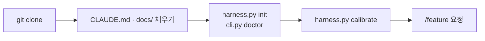
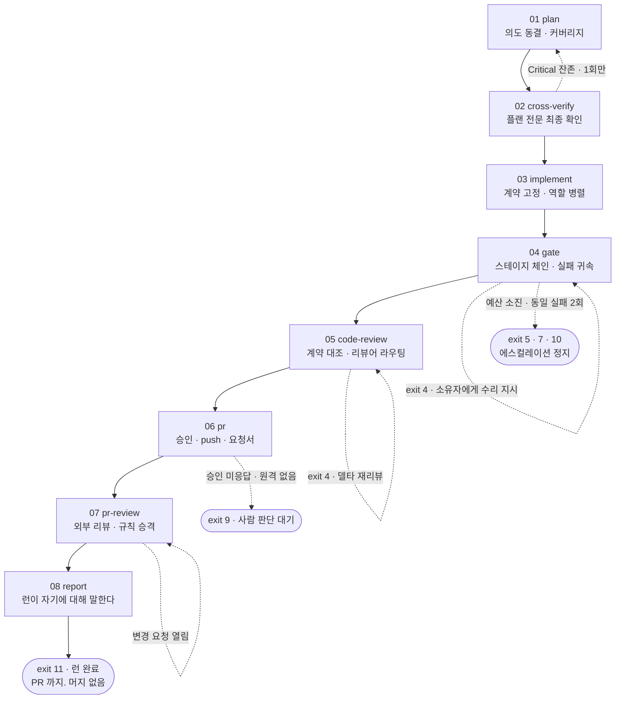

# harness-template

요청 하나를 **계획 → 교차검증 → 구현 → 게이트 → 코드리뷰 → PR → PR리뷰 → 보고서**
8페이즈로 끌고 가는 **스택 비종속 개발 하네스 템플릿**이다. clone 해서 문서를 채우고
`/feature <요청>` 을 치면, 실행기가 페이즈마다 무엇을 할지 지시하고 그 산출물을
기계로 검사한다.

- 실행기는 **python stdlib 만** 쓴다 — 프로젝트의 의존성이나 빌드가 깨진 상태에서도 게이트가 돈다
- 스택 지식은 전부 **어댑터**(`harness/adapters/*.json`)에 있고, 코어는 스테이지 **이름**만 안다
- **범위는 PR 까지다. 머지하지 않는다**

## 시작하기 전에 알 것

모르면 오해가 되는 셋을 먼저 적는다.

- **`CLAUDE.md` 는 프롬프트에 자동 주입되지 않는다.** 8페이즈 코어는 `harness/config.json` 의
  `instruction_file` 선언과 `harness/phases/03-implement.md` 의 「읽을 곳」으로 **가리키기만** 한다.
  그것을 통째로 싣던 순차 실행기는 이 템플릿에 없다. **워커가 규칙을 못 본 채 지켰다고
  보고하는 것**이 이 리포가 최악으로 치는 실패다 ([ROADMAP](docs/harness/ROADMAP.md) §4).
- **순차 실행기 `scripts/execute.py` 는 동봉하지 않는다.** 헤드리스 승인 우회를 클론하는
  사람이 물려받지 않게 하기 위해서다 ([DECISIONS](docs/harness/DECISIONS.md) ADR-H005 · ADR-H037).
- **무엇이 검증됐고 무엇이 아직인지**는 [ROADMAP](docs/harness/ROADMAP.md) §6 이 한 표로 든다 —
  어댑터의 `verified` 와 `harness/calibration.json` 은 아직 「아닌」 쪽이다.

## 빠른 시작



1. **clone 하고 문서부터 채운다.** `CLAUDE.md` 의 플레이스홀더와 `docs/` 7종
   (`PRD` · `TRD` · `API_SPEC` · `ARCHITECTURE` · `ADR` · `UI_GUIDE` · `PIPELINE-LOG`)은
   빈 골격이다. **문서가 하네스 설정의 입력**이라, 순서를 뒤집으면 채울 수 없는 칸이 생긴다.

   | 하네스가 알아야 하는 것 | 출처 |
   |---|---|
   | 어떤 어댑터를 쓸 것인가 (빌드·테스트 명령) | `docs/TRD.md` 기술 스택 |
   | 무엇을 만드는가 (계약의 유닛·진입점) | `docs/PRD.md` 유저 스토리 · 기능 요구사항 |
   | 역할별 소유 경계 glob | `docs/ARCHITECTURE.md` 디렉토리 구조 · 레이어 의존 |
   | 게이트가 검사할 규칙 | `CLAUDE.md` 의 CRITICAL 규칙 |
   | 성능·보안 기준선 | `docs/TRD.md` 비기능 요구사항 |

2. **설정을 만든다.** 프로파일 시드를 복사해 `harness/config.json` 을 쓴다.

   ```
   python scripts/harness.py init --adapter nextjs-ts --name my-project
   ```

3. **doctor 를 통과시킨다.** 여기서 막히면 `/feature` 는 시작하지 않는다.

   ```
   python scripts/pipeline/cli.py doctor
   ```

   python 런타임 · 스키마 · 어댑터 전제조건 · 러너 바이너리 · 스테이지 명령의 실물 존재 ·
   역할과 소유 경계 겹침 · 계약 절과 템플릿의 일치 · base 브랜치와 원격 · 경로 240자 상한 ·
   캘리브레이션 상태를 본다. **exit 2 면 거기서 멈추고 FAIL 항목을 고친다.**
   경고는 통과시키되 전부 출력에 드러낸다 — **스킵됨은 통과가 아니다.**

4. **한 번 실측한다.** 스테이지를 1회씩 돌려 `harness/calibration.json` 을 채운다.
   타임아웃 · 백그라운드 회귀 여부 · 테스트 수 하한 같은 정책이 여기서 유도된다.

   ```
   python scripts/harness.py calibrate
   ```

5. **`/feature <요청>` 을 친다.** 나머지는 파이프라인이 끌고 간다.

## 8페이즈가 어떻게 도나

페이즈마다 왕복은 둘뿐이다 — `next`(실행기가 지시문을 낸다) → 모델이 `produces[].path` 에
산출물을 쓴다 → `record`(실행기가 검사하고, 통과하면 다음 페이즈로 전이한다).
04 는 `gate` 로, 08 은 `report` 로 닫는다. **stdout 은 언제나 단일 JSON 봉투 하나**이고
모델이 읽는 것은 봉투의 `render` 와 `next_command` 둘뿐이다.



| 페이즈 | 하는 일 | 주요 산출물 | 통과·정지 조건 |
|---|---|---|---|
| **01 plan** | 원본 요청을 의도로 동결하고, 그 의도를 빠짐없이 덮는 플랜을 만든다. 불변식마다 요청 원문의 부분문자열을 인용으로 달고, 리뷰어 둘을 매 라운드 병렬로 돌린다 | `01_plan.md` · 라운드별 리뷰 파일 | 인용이 실제 부분문자열인가 · 커버리지가 정확히 한 번씩인가 · 심각도 단조성. 수렴 실패는 에스컬레이션 |
| **02 cross-verify** | 확정된 플랜 **전문**에 대한 최종 확인 1회. 01 의 리뷰는 회차마다 그때의 플랜을 봤지 완성본을 본 적이 없다 | `02_verdict.json` | Critical 0. 남으면 01 로 되돌린다(1회). 교차검증기가 아예 없으면 스킵하되 등급은 `PASS_WITH_GAPS` |
| **03 implement** | 메인이 계약 파일을 직접 쓰고, 역할 전원이 **동시에** 자기 소유 경계 안을 채운다. **계약이 「테스트 먼저」의 대역**이라, 구현과 테스트가 서로를 보고 형태를 맞추는 일이 구조적으로 불가능하다 | 계약 파일 · `03_claims.json` | 소유 경계 침범·주인 없는 파일이 없는가 · `compile` 스테이지 통과 |
| **04 gate** | 어댑터가 선언한 스테이지 체인을 돌리고, 실패를 **역할에 귀속**해 그 역할에게만 되돌린다 | `04_gate_report.json` · `attribution.json` | 수리 예산 3. 예산이 남아도 **동일 (소유자, 실패 시그니처)가 2회면 즉시 정지**. 테스트 0개는 비차단 gap, 테스트 수 급감은 차단 |
| **05 code-review** | 「돌아가는가」 다음의 「계약대로인가, 그리고 봐야 할 눈이 봤는가」. 무료 검사(`precheck` → `contract-trace`)를 먼저 하고, 변경 파일에 걸린 리뷰어만 결정론으로 켜서 병렬 호출한다 | `05_trace.json` · `05_review.json` · `05_promo_staged.json` | 재리뷰 예산 2. 리뷰어 전원이 실패하거나 계획된 리뷰어가 0명이면 등급이 `PASS_WITH_GAPS` 로 내려간다 |
| **06 pr** | 「이것을 밖으로 내보내도 되는가」. 승인을 이벤트로 못박고(지문과 등급을 함께), 계약 파일을 지운 뒤 push 하고 PR 요청서를 만든다. **PR 생성은 메인 세션이 forge 도구로** 한다 | `06_pr_body.md` · `06_pr_req.json` | 승인이 없으면 exit 9 로 정상 종료. 승인 후 코드가 바뀌면 재승인. non-FF 는 force-push 하지 않고 에스컬레이션 |
| **07 pr-review** | 05 는 우리가 우리 코드를 봤다. 07 은 **밖이 그것을 어떻게 보는가**를 받는다. 외부 리뷰를 수집하고, 원장에 쌓인 지적을 규칙으로 승격한다(런당 한 번) | `07_pr_review.json` · `07_promo_applied.json` | 변경 요청이 열려 있으면 정지. 수리 예산 2 |
| **08 report** | 런이 자기에 대해 말하는 유일한 자리. 표는 실행기가 결정론으로 조립하고 서술은 모델이 쓴다. **diff 도 코드도 읽지 않는다** | `docs/harness/pipeline/runs/<run-id>.md` | 보고서는 파이프라인을 실패시키지 않는다. 막는 실패는 하나 — 재지 못한 것이 조용히 통과하는 것 |

## 핵심 파일

### `harness/` — 계약 계층

| 경로 | 무엇 |
|---|---|
| `config.json` | 이 프로젝트의 선언 하나. 어댑터 선택 · 역할과 소유 경계 · 계약 절 제목 · 리뷰어 라우팅 · 예산(파일 수·줄 수·모델 호출 수) · VCS 규약 |
| `config.schema.json` | 위 파일의 스키마. 검증기는 stdlib 자작이고, `_` 로 시작하는 키는 주석으로 보고 건너뛴다 |
| `adapters/*.json` | 스택별 선언 — `self-python`(이 리포 자신) · `nextjs-ts` · `_template`(새로 만들 때 복사한다) |
| `adapters/adapter.schema.json` | 어댑터 스키마. **러너 화이트리스트가 여기 enum 으로 있다** — 실행기 코드에 목록을 두지 않는다 |
| `profiles/<adapter>/config.json` | `harness.py init` 이 읽는 `config.json` 시드. `{{name}}` 만 치환한다 |
| `phases/01~08.md` | 페이즈 정의. `---` 로 감싼 **JSON** 프론트매터에 `requires` · `produces` · `gate` · `loop` · `on_success` 가 선언된다 |
| `templates/contract.md` | 계약 문서 골격. 절 제목은 `config.contract.sections` 와 글자 그대로 일치해야 하고, `doctor` 가 그 불일치를 사전에 거부한다 |
| `calibration.json` | `calibrate` 산출. 스테이지별 실측과 거기서 유도한 정책. **「미측정」과 「0」을 같은 칸에 쓰지 않는다** |

**어댑터는 스택 지식이 코어로 새지 않게 하는 유일한 문**이다. 스테이지 이름 8종
(`compile` · `lint` · `check` · `scoped` · `full` · `e2e` · `build` · `docs`)은 코어가 고정하고
**명령은 어댑터가 소유한다.** 페이즈 파일은 이름만 참조하므로 스택을 갈아도 코어는 0줄이다.
`cmd: null` 은 **없는 것**이지 통과한 것이 아니다.

### `scripts/` — 실행기

| 경로 | 무엇 |
|---|---|
| `harness.py` | 계약 계층 CLI — `init` · `doctor` · `calibrate` |
| `pipeline/cli.py` | 8페이즈 진입점. 서브커맨드 파싱 · 페이즈 파일 파싱 · 선행조건 판정 · 봉투 발행 |
| `pipeline/state.py` | 런 디렉터리 · `state.json` · `events.jsonl` · 워크트리 지문 · 봉투. 카운터와 등급 **어휘의 단일 출처** |
| `pipeline/adapters.py` | 어댑터 읽기 · 스테이지 실행 · 타임아웃 유도 · 변경 파일 매칭. 판정도 상태 쓰기도 하지 않는다 |
| `pipeline/attribution.py` | 실패 귀속. **순수 함수만** — 직렬화 가능한 것이 곧 replay 픽스처다 |
| `pipeline/contract.py` | 계약 파싱과 스코프 테스트 선택자 조립. 어느 언어의 절 제목도 이 파일에 박혀 있지 않다 |
| `pipeline/gate.py` | 04 본체 — 스테이지 체인 실행과 등급 산정. 전체 회귀는 수리 루프가 끝난 뒤 한 번 |
| `pipeline/trace_contract.py` | 계약이 말한 것이 코드에 실재하는가. 검사 5종(누락 구현 · 오류 상수 · 진입점 · 미테스트 유닛 · 계약 밖 심볼) |
| `pipeline/review.py` | 05 리뷰어 라우팅. **작성자는 리뷰어가 될 수 없다**를 `validate()` 가 강제한다 |
| `pipeline/precheck.py` | 05 의 첫 무료 검사 — 예산 · 브랜치 · base divergence · 인프라. 모델도 러너도 부르지 않는다 |
| `pipeline/mask.py` | 밖으로 나가는 페이로드(PR 본문·코멘트)의 비밀값 마스킹. 내부 기록은 원문을 보존한다 |
| `pipeline/pr.py` | 06 본체 — 승인 · push · 요청서. **forge 를 부르지 않는다**(git 까지가 실행기의 손이다) |
| `pipeline/review07.py` | 07 판정 — 내장 리뷰를 부를지, 어느 effort 로 부를지를 결정론으로 정한다 |
| `pipeline/ledger.py` | 규칙 원장 읽기·쓰기와 승격 후보 산출. **읽고 쓸 뿐 판단하지 않는다** |
| `pipeline/promote.py` | 원장의 지적을 규칙으로 승격한다. 실제 쓰기는 07 에서 런당 한 번 |
| `pipeline/report.py` | 08 — 표는 실행기가 조립하고 서술은 모델이 쓴다 |
| `pipeline/verdict.py` | 제출물 판정 — 의도 동결 · 커버리지 · 드리프트 · 수렴 |
| `runtime.py` | 시각 · 트랜스크립트 읽기 · 출력 인코딩의 공유 원시요소. 코어가 순차 실행기를 물지 않게 하려고 분리했다 |
| `session_log.py` | `SessionEnd` 훅이 부르는 사실 수집기. **해석을 쓰지 않는다.** 실패해도 exit 0 이고, 실패 사실을 원장에 남긴다 |
| `test_harness.py` · `test_pipeline.py` · `test_runtime.py` | 하네스 자신의 테스트 |
| `fixtures/gate/` | `gate --replay` 용 픽스처 |

### `.claude/` — 진입점과 역할

| 경로 | 무엇 |
|---|---|
| `commands/feature.md` | `/feature` — 01~08 을 끌고 가는 오케스트레이션. `doctor` 로 열고, 요청을 한 글자도 바꾸지 않고 동결하고, 종료 코드에 따라 다음 손을 정한다 |
| `commands/log.md` | `/log` — 세션 원장에 쌓인 사실을 `docs/PIPELINE-LOG.md` §5 에 한 줄로 승격한다. 원장에 없는 것은 적지 않는다 |
| `agents/impl-writer.md` · `agents/test-writer.md` | 03 이 **동시에** 부르는 역할. 각자 자기 소유 경계 안만 만진다 |
| `agents/plan-reviewer.md` | 01 · 02 가 부르는 독립 관측자. 플랜을 고치지 않고 findings 만 낸다 |
| `skills/{data-layer,security,architecture,test-quality,docs}-reviewer/SKILL.md` | 05 의 관점 리뷰어 5종. `when` glob 이 변경 파일에 걸리면 켜진다. `docs` 만 소스 변경이 0인 런에서 켜진다 |
| `settings.json` | 훅 3종 — 응답이 끝날 때 테스트 실행 · 세션 종료 시 원장 기록 · 위험한 Bash 명령 차단 |

### `docs/`

| 경로 | 무엇 |
|---|---|
| `docs/` 직속 7종 | **프로젝트가 채우는 자리.** 빈 골격으로 배포된다 |
| `docs/harness/ROADMAP.md` | 이 템플릿에 무엇이 들어 있나 · 시작 순서 · **검증된 것과 아직 아닌 것** |
| `docs/harness/DECISIONS.md` | `ADR-H001`~`ADR-H039` — 왜 그렇게 했나 |
| `docs/harness/PILOT-LOG.md` | 런별 실측. **추정치를 적지 않는다 — 재보지 않은 것은 「미측정」으로 남긴다** |
| `docs/harness/pipeline/team-spec.md` | **8페이즈의 정본.** 계약을 바꾸면 여기를 먼저 고친다 |
| `docs/harness/pipeline/ledger/taxonomy.json` | **원장 어휘 · 승격 목적지 · 리뷰 범위 셋의 단일 출처** |
| `docs/harness/pipeline/ledger/findings.jsonl` | 지적 원장. append-only 라 머지 충돌이 자명하게 union 이다 |
| `docs/harness/pipeline/ledger/rules_changelog.md` | 규칙 승격 이력. `promote` 가 쓰고 사람이 직접 적지 않는다 |

## 명령어

### `python scripts/harness.py`

| 커맨드 | 하는 일 |
|---|---|
| `init --adapter <id> --name <slug>` | 프로파일 시드로 `harness/config.json` 을 만든다. 기존 파일이 있으면 `--force` 없이는 거부한다 |
| `doctor` | 설정과 리포의 어긋남을 실행 전에 잡고, 사람이 읽는 보고서를 낸다 |
| `calibrate [--stage <id>] [--replace]` | 스테이지를 1회씩 실측해 `calibration.json` 을 쓴다. 하나라도 실패하면 **파일을 쓰지 않는다** — 빨간 트리에서 잰 값은 캘리브레이션이 아니다 |

### `python scripts/pipeline/cli.py`

`--help` 가 없다. argparse 의 도움말이 stdout 으로 나가면 단일 JSON 봉투 계약이 깨지기 때문이다.

| 커맨드 | 하는 일 |
|---|---|
| `doctor` | 계약 계층 검사 + 파이프라인 검사 7종(작업 공간 무시 · 역할 에이전트 실재 · 페이즈 파일 · 계약 템플릿 파싱 · 리뷰어 · 원격과 base · 외부 리뷰 봇) |
| `init --feature <slug> --request-file <path>` | 런을 만들고 요청 파일을 바이트 그대로 동결한다 |
| `next [--run-id <id>]` | 선행조건을 검증하고 다음 지시문을 렌더한다. 세션이 끊겼을 때의 복구 경로도 이것이다 |
| `record --phase <nn> [--file …] [--reviewer …] [--round n] [--failed]` | 제출물을 검사하고, 통과하면 다음 페이즈로 전이한다 |
| `gate [--phase 04] [--stage <id>] [--replay <dir>]` | 어댑터 스테이지를 돌리고 리포트를 파싱해 실패를 귀속한다 |
| `advance --phase <nn>` | 명시 전이. 게이트 뒤에 소스가 바뀌었으면 지문이 stale 이라 막는다 |
| `retry --phase <nn> --counter <name> --reason <text>` | `failed` 를 `running` 으로. **재작업의 유일한 문** |
| `escalate [--reason <text>]` | 상태를 잠그고 선택지 셋(이대로 진행 · 범위 축소 · 중단)을 제시한다 |
| `resume --ack` | 에스컬레이션 잠금 해제 **전용** |
| `status` | 현황. **항상 exit 0** — 상태를 묻는 것이 실패일 수는 없다 |
| `abandon --reason <text>` | 런을 명시적으로 닫는다. 사유가 없으면 원장에서 포기와 장애가 같아 보인다 |
| `lint-phases [--dir <path>]` | 페이즈 파일 정합. **CI 없이도 도는 유일한 검증 장치**다 |
| `precheck [--scope pr] [--phase 05]` | 예산 · 브랜치 · base divergence · 인프라의 정적 검사 |
| `contract-trace [--contract <path>]` | 계약 ↔ 코드 대조 5종 |
| `approve --phase 06 [--auto] [--revoke]` | 승인을 이벤트로 못박고, 지문과 등급을 함께 기록한다 |
| `mask --file <in> --out <out>` | 밖으로 나갈 페이로드를 마스킹한다 |
| `pr` | 06 의 여섯 단계를 비용 오름차순으로 돌리고 첫 실패에서 멈춘다 |
| `promote --scan / --stage / --apply / --flush` | 원장 재집계 → staged 적재 → 실제 쓰기 → 잔여 종결 |
| `review07 [--external <path>]` | 07 의 생략 조건과 effort 를 결정론으로 정한다 |
| `report [--out <path>]` | 08 보고서를 조립한다 |
| `cost` | 런 비용을 원장과 트랜스크립트에서 읽는 시점에 집계한다 |

### 종료 코드

| 코드 | 뜻 | 코드 | 뜻 |
|---|---|---|---|
| `0` | 성공 | `6` | `advance` 거부 (지문 stale) |
| `1` | 내부 오류 | `7` | 반복 한계 · 정체 |
| `2` | 사용법 · 미해결 플레이스홀더 · `doctor` 미통과 | `8` | 제출물 위반 |
| `3` | 선행조건 미충족 | `9` | 사용자 판단 대기 |
| `4` | 기계 판정 실패 (예산 남음) | `10` | 에스컬레이션 (상태를 잠근다) |
| `5` | 예산 소진 | `11` | 런 완료 |

### 하네스 자신의 테스트

```
python -m pytest scripts/
```

## 더 읽을 곳

- [docs/harness/pipeline/team-spec.md](docs/harness/pipeline/team-spec.md) — **8페이즈의 정본.** 페이즈 01~08 · 종료 코드표 · 실패 분류 · 수렴 판정 · 귀속 규칙 · 승격 임계값
- [docs/harness/ROADMAP.md](docs/harness/ROADMAP.md) — 이 템플릿의 구성물(§1) · 시작 순서(§4) · **검증된 것과 아직 아닌 것**(§6)
- [docs/harness/DECISIONS.md](docs/harness/DECISIONS.md) — `ADR-H001`~`ADR-H039`
- [CLAUDE.md](CLAUDE.md) — 작업 원칙 넷과 프로젝트 규칙. **워커가 읽어야 지켜진다**
