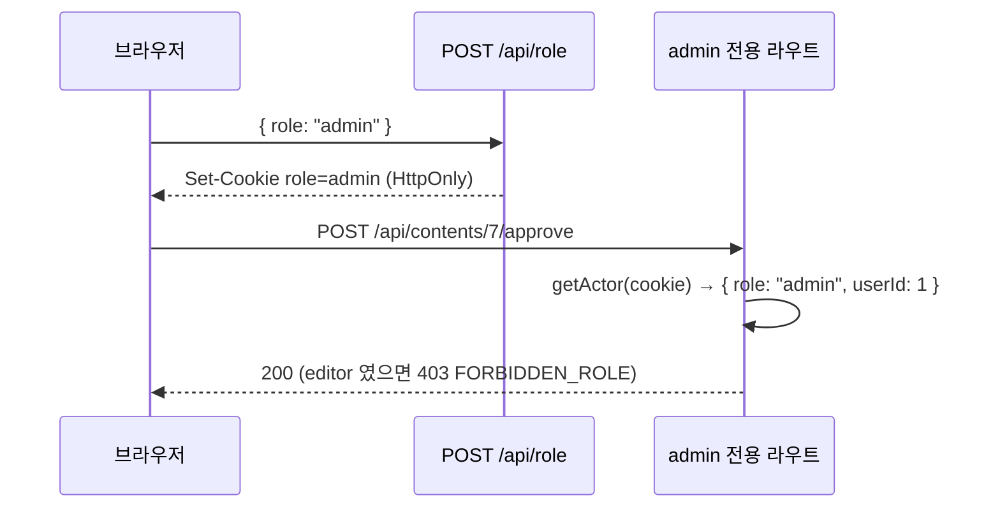

# API 명세

> 이 문서가 API 계약의 **단일 출처**다. 계약을 바꾸면 여기를 먼저 고친다.
> 요청·응답의 zod 스키마 이름은 `src/lib/schemas.ts` 의 export 이름과 같다 — 계약의 「데이터 형태」절에 그대로 옮겨 적는다.
> 절 제목은 지우지 않는다.

## 공통 규약

| 항목 | 규약 |
|---|---|
| 베이스 경로 | `/api` (버전 접두 없음 — 사내 단일 클라이언트) |
| 콘텐츠 타입 | 요청·응답 모두 `application/json; charset=utf-8` |
| 성공 응답 | `{ "data": … }` — 200(조회·전이), 201(생성) |
| 실패 응답 | `{ "error": { "code": ErrorCode, "message": string, "details"?: unknown } }` |
| 결과 없음 | **실패가 아니다.** 200 + `data: []` 또는 `data: null` |
| 역할 | 쿠키 `role` = `editor` \| `admin`. 없으면 `editor` 로 본다. admin 전용 라우트는 아니면 403 |
| 날짜 | `YYYY-MM-DD` (날짜), ISO 8601 UTC (시각) |
| 금액 | `{ "amount": "1234.5000", "currency": "KRW" }` — 문자열 decimal. 환산값은 응답에서만 `krw` 필드로 덧붙인다 |
| ID | 정수(`bigint` 를 숫자로 직렬화, 2^53 미만 보장) |
| 페이지네이션 | 없음. 목록은 필터로 줄인다 (사내 규모) |
| 실행 시간 | 라우트별 `maxDuration`(`TRD.md` §9). 넘기면 504 `LLM_TIMEOUT` 또는 Vercel 504 |
| 공통 타입 | `Lang = 'ko' \| 'en'` · `Role = 'editor' \| 'admin'` · `ContentStatus = 'draft' \| 'in_review' \| 'approved' \| 'rejected' \| 'published'` · `PlanStatus = 'scheduled' \| 'generating' \| 'in_review' \| 'approved' \| 'published' \| 'on_hold'` · `PostType = 'health_info' \| 'activity_news' \| 'comparison' \| 'review'` |

## 엔드포인트 목록

### Must

| 메서드 | 경로 | 역할 | 설명 | maxDuration |
|---|---|---|---|---|
| POST | `/api/role` | 누구나 | 역할 쿠키 설정 (담당자/대표 전환) | 10 |
| GET | `/api/products` | 누구나 | 제품 목록 | 10 |
| GET | `/api/channels` | 누구나 | 채널 목록 (`kind` 필터) | 10 |
| GET | `/api/rules/resolve` | 누구나 | 채널·언어·제품 조합의 병합 규칙 | 10 |
| GET | `/api/plans` | 누구나 | 월별 발행 계획 + 파생 상태 | 10 |
| POST | `/api/plans/sync` | 누구나 | 시트 읽어 동기화 | 30 |
| POST | `/api/contents/titles` | 누구나 | 제목+앵글 3안 (저장 없음) | 30 |
| POST | `/api/contents` | 누구나 | 초안 생성 + 링크 + 본문 생성 + 검증 | 60 |
| GET | `/api/contents` | 누구나 | 콘텐츠 목록 (상태·내 작업 필터) | 10 |
| GET | `/api/contents/{id}` | 누구나 | 콘텐츠 상세 (본문·검출·프롬프트·이력 수) | 10 |
| PATCH | `/api/contents/{id}` | 누구나 | 제목·본문 직접 편집 → 재검증 | 10 |
| POST | `/api/contents/{id}/regenerate` | 누구나 | 지시문으로 본문 다시 만들기 | 60 |
| POST | `/api/contents/{id}/submit` | 누구나 | 검수 요청 (`draft`/`rejected` → `in_review`) | 10 |
| POST | `/api/contents/{id}/cancel-review` | 누구나 | 검수 요청 취소 (`in_review` → `draft`) | 10 |
| POST | `/api/contents/{id}/approve` | admin | 승인 (+ 브랜드 예시 등록) | 10 |
| POST | `/api/contents/{id}/reject` | admin | 반려 (사유 필수) | 10 |
| POST | `/api/contents/{id}/publish` | 누구나 | 발행 완료 (URL 선택, HEAD 확인) | 15 |
| POST | `/api/contents/{id}/new-version` | 누구나 | 발행된 글의 새 버전 초안 | 10 |
| DELETE | `/api/contents/{id}` | 상태별(본문 참고) | 콘텐츠 삭제(하드 삭제) | 10 |
| GET | `/api/fx` | 누구나 | 날짜 기준 환율 (신선도 포함) | 10 |

### Should

| 메서드 | 경로 | 역할 | 설명 |
|---|---|---|---|
| GET / POST | `/api/fx/refresh` | 크론 (`Authorization: Bearer CRON_SECRET`) | 환율 적재 (Vercel Cron 은 GET 으로 부른다) |
| POST | `/api/fx` | admin | 환율 수동 입력 |
| POST | `/api/plans/webhook` | Apps Script (`X-Sheet-Secret`) | 시트 저장 시 동기화 |
| GET / POST | `/api/cost-sheets` | admin | 원가표 목록 / 새 버전(복제 포함) |
| PATCH | `/api/cost-sheets/{id}` | admin | 작성중 원가표의 항목 갱신 |
| POST | `/api/cost-sheets/{id}/confirm` | admin | 확정 (잠금) |
| GET | `/api/cost/calc` | admin | 채널·환율로 개당 원가·마진·BEP |
| GET / POST | `/api/ads` | admin | 광고 성과 조회(원화 환산 ROAS) / 월 단위 입력 |

## 엔드포인트 상세

### POST `/api/role`

요청 `SetRoleInput { role: Role }` → 200 `{ data: { role } }` + `Set-Cookie: role=…; HttpOnly; SameSite=Lax; Path=/`.

### GET `/api/products`

→ 200 `{ data: Product[] }` · `Product { id, productCode, name, weightG, priceKrw: string|null, priceUsd: string|null, isActive }`.

### GET `/api/channels?kind=sales|content`

→ 200 `{ data: Channel[] }` · `Channel { id, channelCode, name, kind, country, currency, lang, distributionRoute, feeRate: string, publishMethod, trackingMethod, linkPolicy, writeUrl, persona, tone, format }`.

### GET `/api/rules/resolve?channelId&lang&productId?`

병합 순서 공통 → 국가 → 채널 → 제품 (`TRD.md` FR-003).

→ 200 `{ data: ResolvedRules }`

```
ResolvedRules {
  version: string              // 예 "v12" = 적용 규칙 중 최대 version
  appliedRuleIds: number[]
  persona: string              // 읽을 사람 (제품 > 채널 > 국가 > 공통)
  tone: string
  format: string
  must: string[]               // 합집합
  ban: BanRule[]               // 합집합
}
BanRule { ruleId, label, detectPattern, severity: 'block'|'warn', alternative, reason, legalBasis }
```

채널이 없으면 404 `NOT_FOUND`. 규칙이 하나도 없으면 200 + 빈 배열들(결과 없음).

### GET `/api/plans?month=YYYY-MM`

→ 200 `{ data: { plans: Plan[], lastSync: ImportSummary|null } }`

```
Plan {
  id, sheetRowKey, scheduledDate, channelId, channelName: string,
  productId: number|null, productName: string|null, lang,
  postType: PostType, topicMemo, ownerId: number|null, ownerName: string|null,
  onHold: boolean,
  status: PlanStatus,          // 파생값 — 저장하지 않는다
  contentId: number|null
}
ImportSummary { id, createdAt, totalRows, okRows, failedRows, trigger: 'manual'|'webhook' }
```

`month` 형식 오류 400. 계획 0건은 200 + `plans: []`.

### POST `/api/plans/sync`

요청 본문 없음 → 200 `{ data: SyncResult }`.

```
SyncResult { importId, totalRows, upserted, held, failed, errors: SheetRowIssue[] }
SheetRowIssue { row: number, column?: 'A'|'B'|'C'|'D'|'E'|'F'|'G'|'H', reason: SheetRowError }
SheetRowError = 'MISSING_REQUIRED' | 'INVALID_DATE' | 'UNKNOWN_CHANNEL' | 'UNKNOWN_PRODUCT'
              | 'UNKNOWN_LANG' | 'UNKNOWN_POST_TYPE' | 'DUPLICATE_KEY'

SheetPlanRow {                 // zod SheetPlanRowSchema — 시트 한 행의 형태 (TRD §4 「시트 행 계약」)
  planId: string(≥1), scheduledDate: 'YYYY-MM-DD', channel: string, product: string,
  lang: Lang, postType: '건강정보형'|'활동소식형'|'비교큐레이션형'|'후기리뷰형',
  topic: string, owner: string
}
```

`row` 는 시트 행 번호(헤더 = 1). 건너뛴 행은 `failed` 에 세고 나머지 행은 정상 반영된다 — 행 단위 실패는 동기화 실패가 아니다. 전부 빈 행은 `totalRows` 에서 빠진다. `SheetRowError` 는 닫힌 집합이고 응답 봉투의 `ErrorCode` 와 다른 어휘다(행 단위 사유이지 HTTP 실패가 아니다).
시트를 못 읽으면 502 `SHEET_FETCH_FAILED` (기존 계획은 그대로). 시트가 비어 있으면 200 + `totalRows: 0`(모든 기존 행 `held`).

### POST `/api/contents/titles`

요청 `TitleRequest { productId: number|null, channelId, lang, postType, topicMemo, targetPersona }`
→ 200 `{ data: TitleCandidates }` · `TitleCandidates { items: { title, angle }[] /* 3 */, regeneratedIdx: number[] /* 차단어로 재생성한 항목 */ }`
LLM 실패 502 `LLM_FAILED`, 20초 초과 504 `LLM_TIMEOUT`.

### POST `/api/contents`

초안 생성 → UTM 링크 → 본문 생성 → 검증 → 저장을 한 요청에서.

요청 `CreateContentInput { publishPlanId: number|null, productId: number|null, channelId, lang, postType, topicMemo, targetPersona, title, angle, titleCandidates: {title, angle}[] }`
→ 201 `{ data: ContentDetail }`

```
ContentDetail {
  id, publishPlanId, sourceContentId, productId, channelId, lang, postType,
  targetPersona, status: ContentStatus, title, body, regenCount,
  link: string|null,                 // UTM 링크. link_policy=none 이면 화면 표시용으로만
  validation: ValidationResult,
  ruleSnapshot: { ruleIds: number[], version: string, exampleIds: number[] },
  sentPrompt: string, model: string,
  rejectReason: string|null, publishedUrl: string|null, urlCheck: 'ok'|'unreachable'|'skipped'|null,
  authorId, reviewerId, publisherId,
  submittedAt, reviewedAt, publishedAt, updatedAt, createdAt,
  isExample: boolean, historyCount: number,
  autoRegenerated: boolean,          // 차단어로 1회 자동 재생성했는가
  channelFormat: ChannelFormat|null  // FR-012. status='approved'일 때만 계산, 그 외 null
}
ValidationResult {
  blocks: Finding[], warns: Finding[], missing: string[]
}
Finding { ruleId, label, matched: string, index: number, severity, alternative, reason }
ChannelFormat {
  body: string,        // 채널 형식이 반영된 본문(인스타/아마존은 원본, 블로그는 UTM 링크 없으면 끝에 추가)
  hashtags: string[],  // 본문에서 추출한 해시태그. 인스타 외에는 항상 []
  writeUrl: string|null
}
```

계획이 이미 다른 콘텐츠와 연결돼 있으면 409 `INVALID_TRANSITION`. LLM 실패 시 502/504 이되 **행은 `draft` 로 남고** 응답 `details.contentId` 로 알려준다.

### GET `/api/contents?status=&mine=true`

→ 200 `{ data: ContentSummary[] }` · `ContentSummary { id, title, status, channelId, lang, publishPlanId, scheduledDate: string|null, authorId, authorName, warnCount, updatedAt, submittedAt }`. 검수함은 `status=in_review` 로 부르고 클라이언트가 `submittedAt` 오름차순.

`mine=true`는 실사용자 식별자가 없어(ADR-004, FR-015 미구현) `role`과 같은 role을 가진 유일한 시드 유저의 `authorId`로 근사한다 — role당 유저가 여러 명이 되면 정확하지 않다(부채).

### GET `/api/contents/{id}`

→ 200 `{ data: ContentDetail }` · 없으면 404.

`link`는 저장되지 않고(스키마에 컬럼 없음) 매 조회마다 `buildUtmLink()`로 재계산한다(ADR-005와 같은 원칙 — 파생값은 저장하지 않는다).

`channelFormat`도 저장되지 않고 `status='approved'`일 때만 매 조회마다 계산한다(FR-012, US-012). 그 외 상태는 `null`이다.

### PATCH `/api/contents/{id}`

요청 `EditContentInput { title?: string, body?: string }` → 200 `{ data: ContentDetail }` (재검증 포함). `published` 는 409.
`rejected` 상태의 콘텐츠를 편집하면 `draft` 로 전이한다(FR-011 — "수정하러 가기"). 그 외 상태(`draft`·`in_review`·`approved`)는 상태가 바뀌지 않는다.

### POST `/api/contents/{id}/regenerate`

요청 `RegenerateInput { instruction?: string, title?: string, angle?: string, titleCandidates?: {title, angle}[] /* 3 */ }` → 200 `{ data: ContentDetail }`. `in_review`·`approved`·`published` 는 409. LLM 실패 시 이전 본문 유지, 502/504.

`title`이 있으면(=콘텐츠 상세 "다시 만들기"에서 제목을 새로 골라 본문까지 다시 만드는 경우) `instruction`은 무시하고, 기존 본문을 지시문으로 고치는 대신 `POST /api/contents`의 초안 생성과 같은 제목·앵글 기반 프롬프트로 본문을 새로 만든다. `title`·`titleCandidates`도 함께 갱신한다 — **콘텐츠 행은 그대로(같은 id)**이고 새 행을 만들지 않는다(ADR-007, 계획:콘텐츠 1:1 유지).

### POST `/api/contents/{id}/submit`

본문 없음 → 200 `{ data: ContentDetail }`. 차단이 남아 있으면 422 `BLOCKED_TERMS_REMAIN`(`details.blocks`). `draft`·`rejected` 외 409.

### POST `/api/contents/{id}/cancel-review`

→ 200. `in_review` 외 409. 작성자 본인만(시드 2명이라 역할로 대신: editor 만).

응답은 다른 상태 변경 라우트와 같은 봉투 `{ data: ContentDetail }`다(200).

### POST `/api/contents/{id}/approve` (admin)

요청 `ApproveInput { registerAsExample: boolean }` → 200 `{ data: ContentDetail & { exampleRegistered: boolean, exampleSkippedReason: string|null } }`. `in_review` 외 409. editor 는 403.

### POST `/api/contents/{id}/reject` (admin)

요청 `RejectInput { reason: string /* 1~1000 */ }` → 200. 사유 없으면 400. `in_review` 외 409.

### POST `/api/contents/{id}/publish`

요청 `PublishInput { publishedUrl?: string /* url */ }` → 200 `{ data: ContentDetail }` — `urlCheck` 는 `ok | skipped`(성공 응답에는 `unreachable` 이 나오지 않는다). URL 이 있고 HEAD 확인이 `unreachable` 이면 422 `URL_UNREACHABLE`(상태는 `approved` 로 유지, 재시도 가능). URL 없음(`skipped`)이거나 `ok` 면 200, `published`. `approved` 외 409.

### POST `/api/contents/{id}/new-version`

→ 201 `{ data: ContentDetail }` — 새 행(`sourceContentId = id`, `status='draft'`, 제목에 ` (v2)`), 계획 연결은 새 행으로 이전. `published` 외 409.

### DELETE `/api/contents/{id}`

본문 없음 → 200 `{ data: { id: number } }`. `draft`·`in_review`·`rejected` 는 누구나,
`approved` 는 admin만(editor 는 403 `FORBIDDEN_ROLE`), `published` 는 409
`INVALID_TRANSITION`. 없으면 404. 하드 삭제 — `contents` 행과 연결된
`content_history` 행을 지우고 `brand_examples.content_id` 는 null 처리한다(다중 문
트랜잭션이 없어(ADR-002) 자식 → 부모 순서로 실행, 재시도해도 안전하도록 부모 삭제를
마지막에 둔다).

### GET `/api/fx?date=YYYY-MM-DD`

→ 200 `{ data: FxSnapshot }` · `FxSnapshot { asOf: string, staleDays: number, rates: { usdKrw: string, phpKrw: string }, source: 'api'|'manual' }`. `date` 를 생략하면 오늘(UTC). `asOf` 는 `date` 이하에서 두 통화쌍이 모두 있는 가장 최근 기준일이고 `staleDays = max(0, date − asOf)`(일). 환율이 한 행도 없으면 503 `FX_UNAVAILABLE`.

### GET · POST `/api/fx/refresh` (크론)

두 메서드가 같은 동작이다 — Vercel Cron 은 GET 으로 부르고, 사람이 수동으로 다시 돌릴 때는 POST 를 써도 된다. 헤더가 `Authorization: Bearer ${CRON_SECRET}` 와 정확히 같지 않으면(헤더 없음 · `CRON_SECRET` 미설정 포함) 403 `FORBIDDEN_ROLE` 이고 외부 호출을 하지 않는다. 기준일(`rate_date`)은 **적재일(UTC 오늘)** 이다 — ECB 가 갱신하지 않는 주말·공휴일엔 직전 게시값이 그날 날짜로 저장된다. → 200 `{ data: FxSnapshot }`. 외부 실패(네트워크·타임아웃·비 2xx·스키마 위반) 503 `FX_UNAVAILABLE`(기존 값 유지).

### POST `/api/fx` (admin)

요청 `ManualFxInput { rateDate, usdKrw: string, phpKrw: string }` → 201 `{ data: FxSnapshot }`(`source: 'manual'`). 같은 `rateDate` 로 다시 넣으면 두 행을 덮어쓴다. editor 는 본문을 보기 전에 403 `FORBIDDEN_ROLE`, 본문이 zod 를 통과 못 하면 400.

### POST `/api/plans/webhook`

헤더 `X-Sheet-Secret` 검사. 본문 무시(트리거일 뿐). → `/api/plans/sync` 와 같은 응답.

### `/api/cost-sheets` · `/api/cost/calc` · `/api/ads` (Should)

```
CostSheet { id, productId, distributionRoute: 'kr_domestic'|'us_export'|'ph_local', name, effectiveFrom, status: 'draft'|'confirmed', confirmedAt, items: CostItem[] }
CostItem { id?, stage: 'ph'|'kr'|'us', costKind, amount: string, currency, basis: 'per_unit'|'per_batch', batchQty: number|null }
CreateCostSheetInput { productId, distributionRoute, name, cloneFromId?: number }
UpdateCostSheetInput { name?, items: CostItem[] }     // 작성중만, 전체 교체
GET /api/cost/calc?productId&channelId&phpRate?&usdRate?
CostCalcResult { legs: { ph: Money, kr: Money|null, sell: Money }, unitCostKrw, priceKrw, marginKrw, marginRate, bepQty: number|null, fx: { php, usd, isSimulation }, sensitivity: { costDeltaKrwPer1pct, marginRateDeltaPer1pct } }
AdPerformance { id, channelId, periodStart, periodEnd, spend: Money, revenue: Money, orders, inputSource, krw: { spend, revenue }, roas: number|null }
AdPerformanceInput { channelId, periodStart, periodEnd, spend: string, revenue: string, orders?: number }
```

확정 원가표가 없는 조합은 200 + `data: null`(결과 없음). 환율이 없으면 503.

## 에러 응답 규약

닫힌 집합이다. 여기 없는 코드를 코드에 만들지 않는다. **실패와 결과 없음에 다른 코드를 준다** — 결과 없음은 코드가 없다(200).

| 코드 | HTTP | 뜻 | `details` |
|---|---|---|---|
| `VALIDATION_ERROR` | 400 | 요청 본문·쿼리가 zod 를 통과 못 함 | zod issues |
| `FORBIDDEN_ROLE` | 403 | admin 전용 라우트를 editor 가 호출, 또는 크론·웹훅 시크릿 불일치 | `{ required: 'admin' }` |
| `NOT_FOUND` | 404 | 콘텐츠·계획·채널·원가표가 없음 | `{ resource, id }` |
| `INVALID_TRANSITION` | 409 | 현재 상태에서 허용되지 않는 액션, 또는 계획에 이미 콘텐츠 연결 | `{ from, action }` |
| `BLOCKED_TERMS_REMAIN` | 422 | 차단 등급 표현이 남아 검수 요청 불가 | `{ blocks: Finding[] }` |
| `URL_UNREACHABLE` | 422 | 발행 URL 을 HEAD 로 확인할 수 없음 | `{ publishedUrl }` |
| `LLM_FAILED` | 502 | LLM 호출 실패 또는 출력이 스키마 위반(재시도 후) | `{ contentId?, attempt }` |
| `LLM_TIMEOUT` | 504 | LLM 타임아웃 (제목 20초 · 본문 45초) | `{ contentId? }` |
| `SHEET_FETCH_FAILED` | 502 | Sheets API 실패·권한 없음 | `{ lastSyncAt }` |
| `FX_UNAVAILABLE` | 503 | 환율 조회·적재 실패 | `{ lastRateDate }` |
| `INTERNAL` | 500 | 그 밖의 서버 오류 (DB 포함) | 없음 (로그에만) |

응답 예:

```json
{ "error": { "code": "BLOCKED_TERMS_REMAIN", "message": "차단 등급 표현이 남아 있어 검수 요청을 보낼 수 없습니다.", "details": { "blocks": [ { "ruleId": 3, "label": "질병 치료·예방 표현", "matched": "혈당을 치료", "index": 214, "severity": "block", "alternative": "혈당 관리에 관심 있는 분께", "reason": "식약처 표시광고 기준" } ] } } }
```

## 인증·인가 흐름

**인증: 없음.** 사내 3명이 쓰는 시연 단계 도구이고 4일 안에 만들어야 해서 로그인을 두지 않았다(ADR-004). 외부 URL 을 공개하거나 인터뷰 이후 운영에 들어가면 Auth.js(이메일+비밀번호, 초대제)를 도입한다.

**인가: 역할 쿠키.**



admin 전용: `approve` · `reject` · `POST /api/fx` · `/api/cost-sheets*` · `/api/cost/calc` · `/api/ads`. 시스템 전용(시크릿 헤더): `/api/fx/refresh` · `/api/plans/webhook`. 나머지는 두 역할 모두.

화면에서 버튼을 숨기는 것은 인가가 아니다 — 서버가 매 요청 검사한다.
