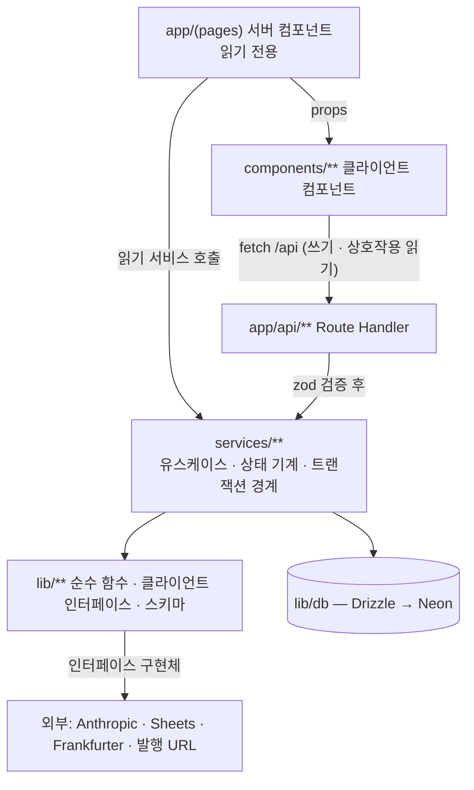
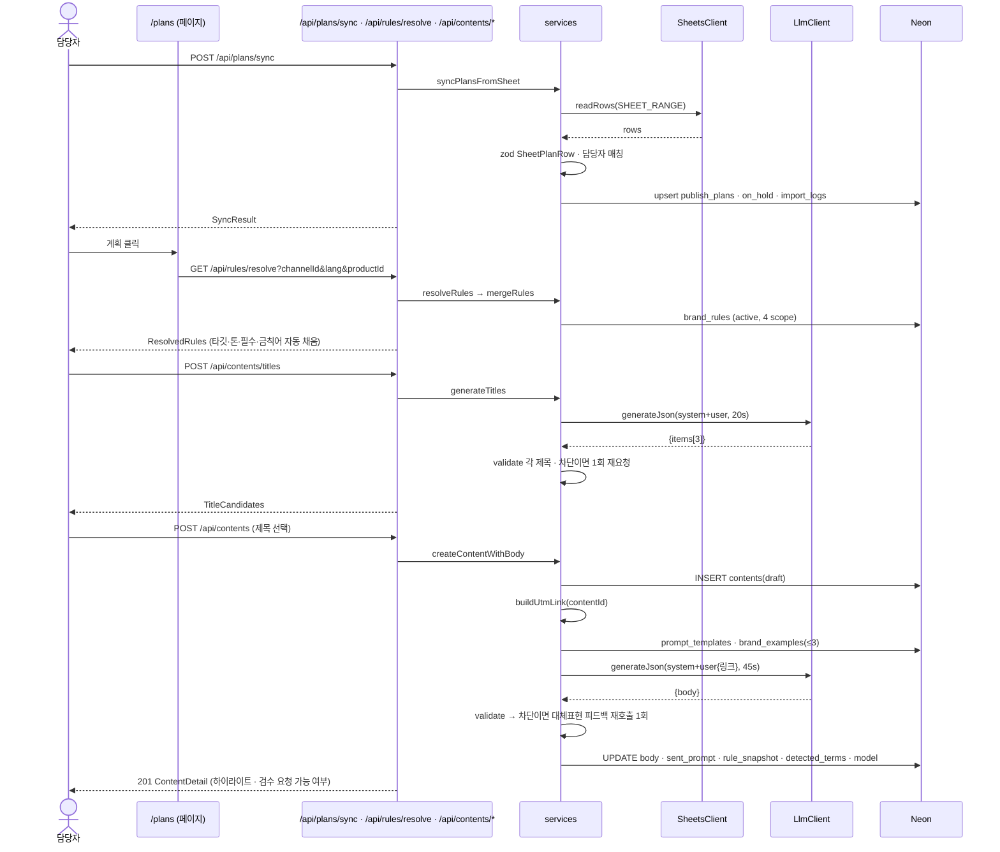
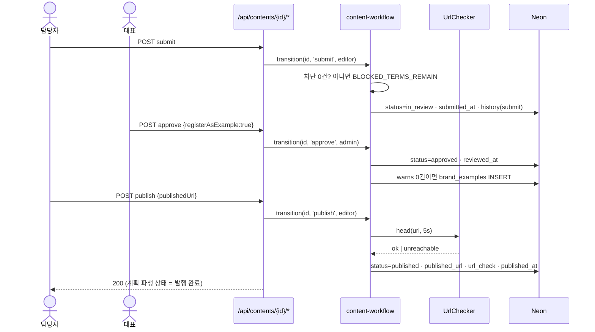
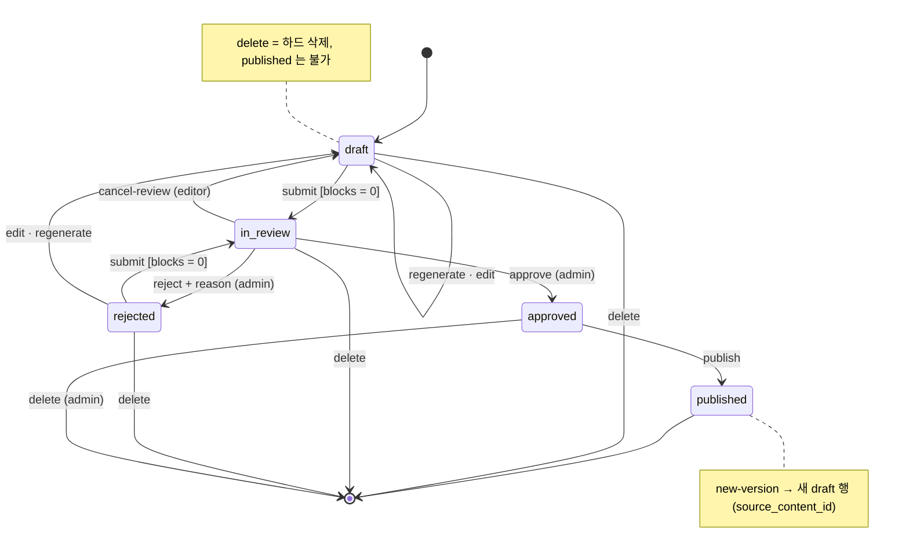
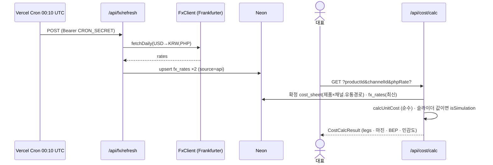

# 아키텍처

> 디렉토리·레이어·흐름·상태를 정한다. 역할별 소유 경계(`harness/config.json` 의 `roles[].owns`)가 여기서 나온다.
> 절 제목은 지우지 않는다.

## 작성 규칙

구조·흐름은 **항상 Mermaid** 로 그린다. ASCII 트리와 화살표 나열은 금지다.

| 무엇을 그리나 | 다이어그램 | 예 |
|---|---|---|
| 디렉토리·모듈 구조, 의존 방향 | `flowchart` (TD/LR) | 아래 「디렉토리 구조」「레이어 의존 관계」 |
| 요청 하나가 거치는 순서 | `sequenceDiagram` | 「데이터 흐름」 |
| 상태 기계 | `stateDiagram-v2` | 콘텐츠 상태 (PRD §5 와 같은 그림) |
| 테이블 관계 | `erDiagram` | 원본은 Miro ERD v7. 이 리포에는 부분만 |

## 디렉토리 구조

```mermaid
flowchart TD
    root["/ (리포 루트)"]
    root --> src["src/"]
    root --> drizzle["drizzle/ — 마이그레이션 SQL (impl 소유)"]
    root --> docs["docs/ — 이 문서들 (메인 소유)"]
    root --> harness["harness/ · scripts/ · .claude/ — 하네스 (메인 소유)"]
    root --> cfg["package.json · tsconfig.json · next.config.ts · vercel.json · drizzle.config.ts (메인 소유)"]

    src --> app["app/"]
    src --> components["components/"]
    src --> services["services/"]
    src --> lib["lib/"]
    src --> types["types/"]

    app --> pages["(pages) — page.tsx 9개<br/>/ · /write · /plans · /contents · /ads · /perf · /cost · /costsheet · /rules"]
    app --> api["api/**/route.ts — API_SPEC 의 진입점<br/>role · products · channels · rules/resolve · plans · plans/sync · plans/webhook<br/>contents · contents/titles · contents/[id] · contents/[id]/{regenerate,submit,cancel-review,approve,reject,publish,new-version}<br/>fx · fx/refresh · cost-sheets · cost/calc · ads"]
    app --> layout["layout.tsx · globals.css — 토큰 · 상단바 · 내비"]

    components --> shell["shell/ — Topbar · Nav · RoleSwitch · FxRail"]
    components --> ui["ui/ — Panel · KpiBand · Tag · Chip · Button · Field · Notice · Empty · Table"]
    components --> feat["write/ · plans/ · contents/ · cost/ · ads/ — 화면 단위 클라이언트 컴포넌트"]

    services --> s1["plan-sync.ts · plans.ts · rules.ts"]
    services --> s2["content-generation.ts · content-workflow.ts"]
    services --> s3["fx.ts · cost.ts · ads.ts · dashboard.ts"]

    lib --> db["db/client.ts · db/schema.ts · db/seed.ts"]
    lib --> pure["validator.ts · rules-merge.ts · plan-status.ts · utm.ts · channel-format.ts · cost-calc.ts"]
    lib --> ext["llm/client.ts · llm/prompts.ts · sheets.ts · fx-client.ts · url-check.ts"]
    lib --> infra["env.ts · schemas.ts · role.ts · http.ts (응답 봉투 · 에러 매핑)"]

    types --> t["index.ts — 공유 타입 (ContentStatus · PlanStatus · Role …)"]
```

### 역할 소유 경계

`harness/config.json` 의 `roles[].owns` 와 같아야 한다. 어긋나면 `doctor` 가 아니라 03 의 소유 검사가 잡는다.

| 역할 | 소유 | 제외 |
|---|---|---|
| impl (`impl-writer`) | `src/app/**` `src/components/**` `src/lib/**` `src/services/**` `src/types/**` **`drizzle/**`** | `**/*.test.ts` `**/*.test.tsx` `**/*.golden.test.ts` |
| test (`test-writer`) | `src/**/*.test.ts` `src/**/*.test.tsx` `src/**/*.golden.test.ts` | — |
| 메인 단독 | `harness/**` `docs/**` `scripts/**` `.claude/**` `*.md` `*.json` `*.ts`(루트) `.env*` | — |

`drizzle/**` 는 템플릿 프로필에 없다 — 코드 작업 전 `config.json` 에 더한다(`TRD.md` §9). 테스트 파일은 소스 옆에 둔다(`src/lib/validator.golden.test.ts`).

## 레이어 의존 관계

**허용되는 방향만 위에 있다.** 다음은 뒤집힘이고 게이트(architecture-reviewer)가 잡아야 한다.

| 금지 | 이유 |
|---|---|
| `components → services` 직접 import | 클라이언트 번들에 DB 클라이언트가 들어간다. 쓰기는 `/api` 로 |
| `lib → services` | lib 는 순수·인터페이스 층. 유스케이스를 모르면 테스트가 쉽다 |
| `app/api → lib/db` 직접 쿼리 | 라우트는 검증·인가·응답 봉투만. 쿼리는 서비스에 |
| `services` 가 `process.env` 읽기 | `lib/env.ts` 만 읽는다 |
| `services` 가 외부 클라이언트 싱글턴 import | 인자로 받는다(주입). 모킹 지점이 시그니처에 드러난다 |
| 상태 문자열 비교를 `content-workflow.ts` 밖에서 | 전이 규칙이 흩어지면 가드레일(승인 없는 발행 0건)이 깨진다 |

## 패턴

| 패턴 | 형태 | 왜 |
|---|---|---|
| **서비스 = 함수 + 명시적 의존** | `createContentWithBody(deps: { llm: LlmClient, db: Db }, input)` | 테스트가 `deps` 만 바꿔 끼운다. 계약의 「외부 경계」절이 그 시그니처다 |
| **신뢰 경계에서 zod** | `TitleCandidatesSchema.parse(json)` · `SheetPlanRowSchema.safeParse(row)` · `FxResponseSchema` | LLM·시트·환율은 신뢰하지 않는다. 통과 못 하면 `LLM_FAILED` 등으로 |
| **Result 반환** | `type Result<T> = { ok: true, data: T } \| { ok: false, error: ApiError }` | 서비스는 throw 하지 않는다. 라우트의 `lib/http.ts` 가 Result → HTTP 로 매핑 |
| **상태 기계 표** | `content-workflow.ts` 안의 `TRANSITIONS: Record<ContentStatus, Partial<Record<Action, {to, role?, guard?}>>>` | 허용 전이가 한 표에 있고 테스트가 표를 전수 검사한다 |
| **파생 상태 함수** | `derivePlanStatus(plan, content): PlanStatus` | 저장하지 않으므로 어긋날 수 없다 (ADR-007) |
| **프롬프트 조립 분리** | `lib/llm/prompts.ts` 는 문자열만 만든다. 호출은 `LlmClient` | 프롬프트를 스냅샷 테스트할 수 있고 저장할 원문이 그 값이다 |
| **순수 함수는 골든 테스트** | `*.golden.test.ts` 에 입력·기대 표 | 검증기·병합·계산식은 회귀가 조용히 난다 |
| **응답 봉투 하나** | `ok(data, status)` · `fail(code, message, details)` in `lib/http.ts` | `API_SPEC.md` 공통 규약과 에러 어휘를 한 파일이 강제한다 |
| **금액 타입** | `Money { amount: string, currency }` + `toKrw(money, fx)` | 환산 저장 금지(ADR-005)를 타입이 상기시킨다 |

## 데이터 흐름

### ① 시트 → 계획 → 콘텐츠 생성

### ② 검수 → 승인 → 발행

### 콘텐츠 상태 기계 (정본은 `content-workflow.ts` 의 표)

### ③ 환율과 원가 (Should)

## 상태 관리

| 상태 | 어디에 | 원칙 |
|---|---|---|
| 도메인 상태 (계획·콘텐츠·규칙·환율·원가) | **DB 가 유일한 원본** | 서버 컴포넌트는 매 요청 읽는다(`dynamic = 'force-dynamic'`). 클라이언트 캐시 없음 |
| 파생 상태 (계획 상태·검증 결과 요약·ROAS) | 계산 | 저장하지 않는다. 서비스가 응답 시 계산 |
| 화면 상태 (선택된 콘텐츠·필터·현재 단계·슬라이더 값) | 클라이언트 컴포넌트 `useState` / URL 쿼리 | 전역 스토어 없음. 페이지를 나가면 사라져도 되는 것만 |
| 콘텐츠 만들기 작업 중 값 (제목 3안·선택 제목·편집 중 본문) | 클라이언트 `useState` — **본문 생성 전까지 서버에 없다** | 제목 단계는 저장하지 않는다(FR-004). 본문 생성 시 행이 생긴다. 새로고침하면 제목 단계는 잃는다 — 허용 |
| 역할 | `role` 쿠키 | 서버가 매 요청 읽는다. 클라이언트는 표시용으로만 |
| 환율 시뮬레이션 (슬라이더) | 클라이언트 로컬 | 저장하지 않는다. 「초기화」가 오늘 환율로 되돌린다 |
| 액션 후 갱신 | 액션 응답의 `ContentDetail` 로 즉시 교체 + `router.refresh()` | 낙관적 갱신 없음 — 상태 전이는 서버 결과만 믿는다 |
