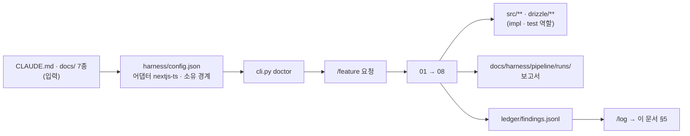

# 파이프라인 기록

> 하네스가 이 프로젝트에서 무엇을 했는지의 기록. §5 는 `/log` 가 세션 원장에서 옮겨 쓴다.
> **잰 것만 적는다.** 안 잰 것은 「미측정」, 안 돈 것은 「아직 런 없음」이다. 절 제목은 지우지 않는다.

## 1. 무엇을 만들었나

바나나아일랜드(㈜코너스톤티엔엠, 그린바나나가루) 사내 운영 도구 `banana-island-ops`. 구글 시트의 발행 계획을 읽어 DB 의 브랜드 규칙·승인된 예시를 자동 참조하는 프롬프트로 다국어(ko·en) 콘텐츠 제목·본문을 생성하고, 금칙어를 코드로 검증한 뒤 대표 승인 → 수동 발행까지 한 화면에서 끌고 간다. 이어서 6개 판매채널 광고 성과(ROAS)와 3국(PHP→KRW→USD) 원가·손익을 같은 도구에 모은다. 스택은 Next.js App Router + Drizzle + Neon Postgres + Anthropic Claude, 배포는 Vercel Hobby. 첫 목표는 2026-09-17 인터뷰 시연용 MVP(콘텐츠 파이프라인 전체)다. 문서 7종과 `CLAUDE.md` 는 2026-09-13 에 사업계획서·목업·Miro ERD v7·운영 메모를 입력으로 채웠고, 코드는 아직 없다.

## 2. 토큰과 시간을 줄이려고 고른 전략 — 실측

아직 런 없음. 첫 `/feature` 런의 `08_report` 가 첫 실측이다. 그 전까지 이 절의 모든 숫자는 **미측정**이다.

| 전략 | 기대 | 실측 |
|---|---|---|
| 계약을 먼저 고정해 구현·테스트 병렬 (03) | 왕복 1회 절감 | 미측정 |
| 순수 함수(검증기·병합·계산)를 골든 테스트로 분리 | 스코프 테스트 시간 단축 | 미측정 |
| 문서를 첨부하지 않고 경로만 가리킴 (§3) | 접두부 축소 | 미측정 |

## 3. 컨텍스트를 어떻게 관리하도록 설계했나

- **가리키기만 하는 것**: `CLAUDE.md`, `docs/` 7종, 계약 파일. 워커는 「읽을 곳」 목록으로 받고 직접 읽는다 — 하네스는 이 파일들을 프롬프트에 싣지 않는다(ROADMAP §4).
- **첨부하는 것**: 계약 파일 전문(역할 프롬프트 패킷 안), 소유권 표, 제출 형식.
- **원본 자료(사업계획서 PDF·목업 HTML·Miro ERD)는 리포에 없다.** 문서가 그 요약이고, 어긋나면 문서를 고친다. 워커가 원본을 다시 읽을 일은 없어야 한다.
- 실측은 아직 없다.

## 4. 8페이즈를 그렇게 설계해서 얻은 것

아직 런 없음. 값을 낸 계층과 못 낸 계층은 첫 세 런 뒤에 가른다.

| 계층 | 값을 냈나 |
|---|---|
| 01 계획 · 02 교차검증 | 아직 런 없음 |
| 03 계약 · 병렬 구현 | 아직 런 없음 |
| 04 게이트 · 귀속 | 아직 런 없음 (어댑터 `nextjs-ts` 는 `verified: false`) |
| 05 리뷰어 5종 | 아직 런 없음 |
| 06~08 PR · 외부 리뷰 · 보고 | 아직 런 없음 |

## 5. 발생한 문제와 해결

`/log` 가 이 표에 행을 추가한다. 세션 원장에 없는 것은 여기 적지 않는다.

| 날짜 | 런 | 무엇이 | 원인 | 해결 | 승격 |
|---|---|---|---|---|---|
| 2026-09-13 | (문서 작성, 런 아님) | 사업계획서 PDF 를 `Read` 로 못 읽음 (`pdftoppm` 없음) | Hancom PDF, 렌더러 미설치 | 표준 라이브러리로 ToUnicode CMap 파싱해 텍스트 추출. 일부 페이지(표지·그림 페이지)는 폰트에 CMap 이 없어 미추출 | — |
| 2026-09-20 | (런 아님 — 원장 점검, 근거: git) | 세션 5개(`a40233e2` · `bb2aa7f0` · `f97bcd3a` · `b2f39a2c` · `b91b99a6`)의 원장 줄이 전부 `head` = `f2cab12`(main) · `commits: []` 로 기록됐다. 같은 시간대(09-19 23:39 ~ 09-20 00:26)에 worktree 브랜치에는 커밋 3개(`55d9a0b` FR-024 · `2007f43` 런 기록 · `5965457` FR-025)가 생겼고 `b91b99a6` 은 `create_pull_request` 를 1회 호출했다. 원장만 읽으면 이 세션들은 「아무것도 안 한 세션」으로 승격돼 기능 2건이 §5 에서 조용히 빠질 뻔했다 | `scripts/session_log.py` 의 `find_root` 가 `CLAUDE_PROJECT_DIR`(세션을 시작한 main 체크아웃)을 훅 입력의 `cwd` 보다 먼저 쓴다. 세션이 worktree(`../banana-island-ops-fr024` · `-fr025` · `.claude/worktrees/feat-should-fr022-fx`)에서 일해도 `head` · `commits` 는 main 에서 읽힌다 | **미해결.** 이번 `/log` 는 git 으로 직접 읽어 구멍만 확인했다. 원장에 근거가 없어 세션↔커밋 귀속은 하지 않았다. 고치려면 `find_root` 가 훅 입력 `cwd` 의 worktree 루트를 먼저 봐야 한다 — 하네스 스크립트 수정은 별도 작업 | — |
| 2026-09-20 | `20260919-2339-ef0e` (원장 `run.basis: touched`) — 실제 커밋된 런 기록은 `20260919-2342-9258` | 세션 `dc46c3a1` 의 원장 줄이 `commits` = `5965457`(FR-025 feat) · `2cfc503`(런 기록), `run` = `20260919-2339-ef0e`(`touched`, `model_calls: 1`) 로 기록됐다. 두 커밋은 모두 `feat-fr-025-brand-rules-screen` worktree(`../banana-island-ops-fr025`, 현재 HEAD `2cfc503`)에서 만들어졌고 `5965457`(00:25:29)은 직전 원장 줄(`b91b99a6`, 00:26:08)보다 먼저다. 이 세션이 원장상 한 일은 `merge_pull_request` 1회(PR #31 → `46ac899`)다. 원장을 그대로 믿으면 FR-025 구현과 그 런이 머지한 세션의 것으로, 런 비용은 보고서가 없는 활성 런(`2339-ef0e`)의 것으로 잘못 귀속될 뻔했다. `tests.app` 682 는 `source: calibration` 이라 이 세션의 실측이 아니다 | 바로 위 행과 같은 뿌리다. `find_root` 가 main 체크아웃을 읽으니 worktree 커밋은 **머지돼 main 에 닿는 순간** `commits_since: prev_entry` 에 들어오고, 그때 끝난 세션에 붙는다. `run` 도 main 쪽 `.harness` 의 활성 런을 읽는다 | **미해결.** 원장 줄은 고치지 않았다(append-only). 여기서는 git 으로 커밋의 worktree 출처만 확인해 귀속 오류를 표시했다. 수정 방향은 위 행과 같다 — `find_root` 가 훅 입력 `cwd` 의 worktree 루트를 먼저 봐야 한다 | — |
| 2026-09-20 | `20260920-0107-4265` (fr020 worktree — 원장 `worktrees[].run.basis: touched`, 등급 PASS_WITH_GAPS, 모델 호출 17회) | FR-020 원가표 PATCH 의 항목 재삽입 `INSERT … SELECT … FROM (VALUES …)` 에서 `batch_qty` 만 목적 열 타입 캐스트가 빠져 있었다. Postgres 가 그 파라미터를 text 로 확정하므로 **항목이 하나라도 있는 모든 저장이 실DB 에서 500** 이 된다. 테스트는 전부 초록이었다 — 스텁이 SQL 문자열을 렌더해 대조하는 방식이라 타입 오류를 **원리상** 못 잡고, 일부는 자리표시자(`$1`)를 문자열로 비교해 늘 참이었다. 05 리뷰어(gen·data 합치)의 SQL 정독이 유일한 방어선이었다 | 스텁 테스트가 「쿼리가 이렇게 생겼는가」만 묻고 「이 쿼리가 DB 에서 도는가」는 묻지 않는다. 같은 런의 04 에서는 테스트 스텁 항목 행에 `costSheetId` 가 빠져 게이트가 실패했는데, 게이트가 이를 `ambiguous` 로 판정해 impl 에 먼저 배정했고 impl 은 스텁에 맞추려 프로덕션 코드에 계약에 없는 특수 분기를 넣었다 — 결함의 출처가 테스트인데 구현을 고치러 보낸 것이다 | 04: 메인이 특수 분기를 되돌리게 해 같은 시그니처가 재발하자 test 에 넘어갔고 test 가 스텁을 실제 행 형태로 고쳤다. 05: 1라운드 4인 리뷰 → impl(캐스트)·ui(`key` 리마운트·응답으로 상태 재설정)·test(자리표시자 대신 params 위치 대조) 병렬 수리 → test 델타 재리뷰에 유효 쿼리 미잠금 1건이 남아 에스컬레이션, 사용자가 「테스트 1건 보강 후 진행」을 골라 보강 → 3라운드 4인 재리뷰 Critical/Major 0. 파일 예산 초과(13·14 > 10)는 사용자가 그대로 진행을 택했다 | `0d4d301` · `67e1cbe` (PR #34 머지). 미해결 Minor 11건(경로 id·`batchQty`·`productId` 상한 부재로 범위 초과가 500, 확정일 UTC 표시, `confirm` 중복 select 등)은 남겼고, 실DB 대상 실행은 하지 않았다(미측정) |

## 6. 구조 — 무엇이 무엇을 부르는가

## 7. 앞으로

다음 런이 답할 것.

1. `harness/config.json` 을 `nextjs-ts` 프로필로 교체하고 `drizzle/**` 소유를 더한 뒤 `doctor` 가 exit 0 인가.
2. `calibrate` 의 스테이지별 시간 — `full` 이 180초를 넘어 백그라운드로 가는가.
3. 첫 `/feature`(스키마·시드·규칙 조회)에서 계약의 유닛 수와 실제 구현 파일 수의 비율.
4. LLM 출력 JSON 스키마 위반율(`llm_called` 로그) — TRD 부채 #10.
5. 시트 컬럼 계약(PRD Q1)을 받은 뒤 `SheetPlanRow` 스키마가 한 번에 맞는가.

## 8. 요약

문서 8종을 채웠고 코드는 없다. 다음은 config 교체 → doctor → calibrate → `/feature`. 실측은 전부 미측정이다.
