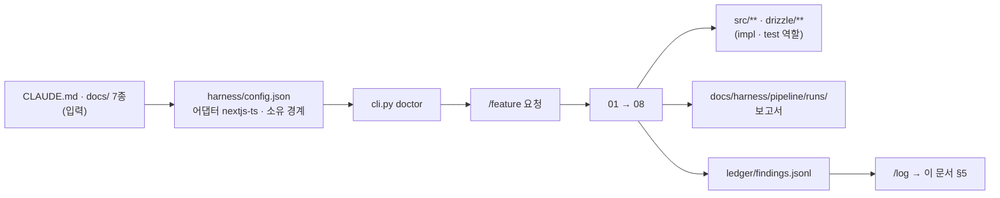

# 파이프라인 기록

> 하네스가 이 프로젝트에서 무엇을 했는지의 기록. §5 는 `/log` 가 세션 원장에서 옮겨 쓴다.
> **잰 것만 적는다.** 안 잰 것은 「미측정」, 안 돈 것은 「아직 런 없음」이다. 절 제목은 지우지 않는다.

## 1. 무엇을 만들었나

바나나아일랜드(㈜코너스톤티엔엠, 그린바나나가루) 사내 운영 도구 `banana-island-ops`. 구글 시트의 발행 계획을 읽어 DB 의 브랜드 규칙·승인된 예시를 자동 참조하는 프롬프트로 다국어(ko·en) 콘텐츠 제목·본문을 생성하고, 금칙어를 코드로 검증한 뒤 대표 승인 → 수동 발행까지 한 화면에서 끌고 간다. 이어서 6개 판매채널 광고 성과(ROAS)와 3국(PHP→KRW→USD) 원가·손익을 같은 도구에 모은다. 스택은 Next.js App Router + Drizzle + Neon Postgres + Anthropic Claude, 배포는 Vercel Hobby. 첫 목표는 2026-09-17 인터뷰 시연용 MVP(콘텐츠 파이프라인 전체)다. 문서 7종과 `CLAUDE.md` 는 2026-09-13 에 사업계획서·목업·Miro ERD v7·운영 메모를 입력으로 채웠고, 코드는 아직 없다.

## 2. 토큰과 시간을 줄이려고 고른 전략 — 실측

아직 런 없음. 첫 `/feature` 런의 `08_report` 가 첫 실측이다. 그 전까지 이 절의 모든 숫자는 **미측정**이다.

| 전략 | 기대 | 실측 |
|---|---|---|
| 계약을 먼저 고정해 구현·테스트 병렬 (03) | 왕복 1회 절감 | 미측정 |
| 순수 함수(검증기·병합·계산)를 골든 테스트로 분리 | 스코프 테스트 시간 단축 | 미측정 |
| 문서를 첨부하지 않고 경로만 가리킴 (§3) | 접두부 축소 | 미측정 |

## 3. 컨텍스트를 어떻게 관리하도록 설계했나

- **가리키기만 하는 것**: `CLAUDE.md`, `docs/` 7종, 계약 파일. 워커는 「읽을 곳」 목록으로 받고 직접 읽는다 — 하네스는 이 파일들을 프롬프트에 싣지 않는다(ROADMAP §4).
- **첨부하는 것**: 계약 파일 전문(역할 프롬프트 패킷 안), 소유권 표, 제출 형식.
- **원본 자료(사업계획서 PDF·목업 HTML·Miro ERD)는 리포에 없다.** 문서가 그 요약이고, 어긋나면 문서를 고친다. 워커가 원본을 다시 읽을 일은 없어야 한다.
- 실측은 아직 없다.

## 4. 8페이즈를 그렇게 설계해서 얻은 것

아직 런 없음. 값을 낸 계층과 못 낸 계층은 첫 세 런 뒤에 가른다.

| 계층 | 값을 냈나 |
|---|---|
| 01 계획 · 02 교차검증 | 아직 런 없음 |
| 03 계약 · 병렬 구현 | 아직 런 없음 |
| 04 게이트 · 귀속 | 아직 런 없음 (어댑터 `nextjs-ts` 는 `verified: false`) |
| 05 리뷰어 5종 | 아직 런 없음 |
| 06~08 PR · 외부 리뷰 · 보고 | 아직 런 없음 |

## 5. 발생한 문제와 해결

`/log` 가 이 표에 행을 추가한다. 세션 원장에 없는 것은 여기 적지 않는다.

| 날짜 | 런 | 무엇이 | 원인 | 해결 | 승격 |
|---|---|---|---|---|---|
| 2026-09-13 | (문서 작성, 런 아님) | 사업계획서 PDF 를 `Read` 로 못 읽음 (`pdftoppm` 없음) | Hancom PDF, 렌더러 미설치 | 표준 라이브러리로 ToUnicode CMap 파싱해 텍스트 추출. 일부 페이지(표지·그림 페이지)는 폰트에 CMap 이 없어 미추출 | — |

## 6. 구조 — 무엇이 무엇을 부르는가

## 7. 앞으로

다음 런이 답할 것.

1. `harness/config.json` 을 `nextjs-ts` 프로필로 교체하고 `drizzle/**` 소유를 더한 뒤 `doctor` 가 exit 0 인가.
2. `calibrate` 의 스테이지별 시간 — `full` 이 180초를 넘어 백그라운드로 가는가.
3. 첫 `/feature`(스키마·시드·규칙 조회)에서 계약의 유닛 수와 실제 구현 파일 수의 비율.
4. LLM 출력 JSON 스키마 위반율(`llm_called` 로그) — TRD 부채 #10.
5. 시트 컬럼 계약(PRD Q1)을 받은 뒤 `SheetPlanRow` 스키마가 한 번에 맞는가.

## 8. 요약

문서 8종을 채웠고 코드는 없다. 다음은 config 교체 → doctor → calibrate → `/feature`. 실측은 전부 미측정이다.
