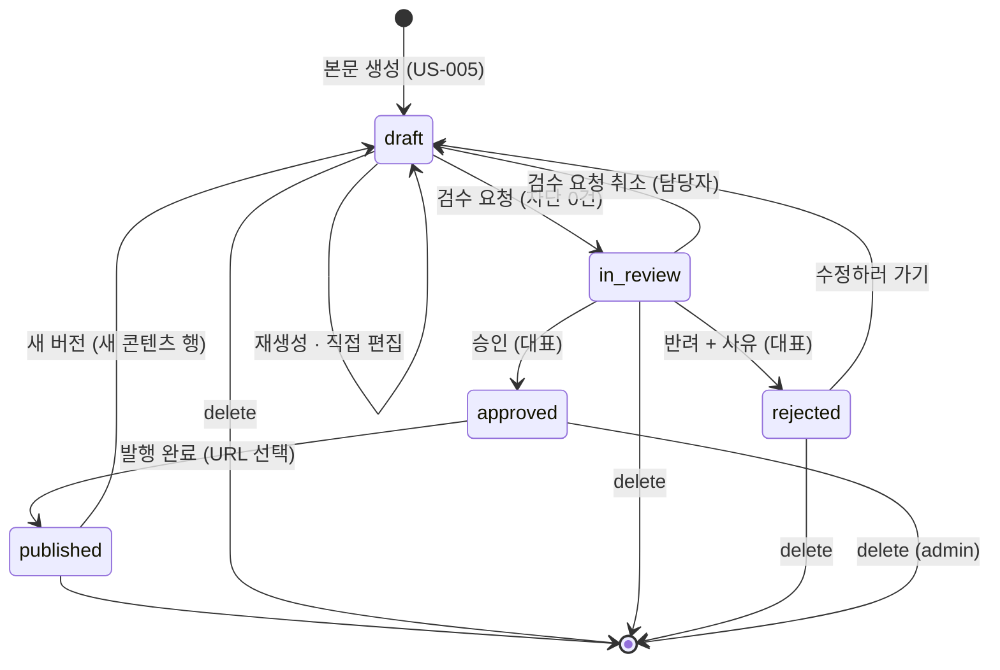
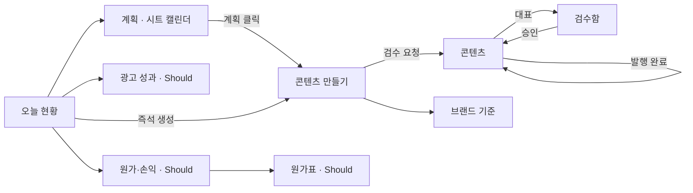

# 제품 요구사항 (PRD)

> 원본 자료: 사업계획서 1·2(코너스톤티엔엠, 2026) · 목업 `bananaislandops_2.html` · Miro ERD v7 · 운영 메모.
> 이 문서는 **무엇을 왜 만드는가**를 정한다. 어떻게는 `TRD.md`, 계약은 `API_SPEC.md` 다.
> 절 제목은 지우지 않는다 — 칸이 사라지면 안 정했다는 사실도 같이 사라진다.

## 0. Core Input

이 제품이 받는 단 하나의 입력은 **발행 계획 한 행**이다.

| 열 | 필드 | 필수 | 예 | 입력 방식 |
|---|---|---|---|---|
| A | 계획ID | 필수 | P-2026-09-001 | 사람이 적음. 시트 안에서 유일 — upsert 키 |
| B | 발행 예정일 | 필수 | 2026-09-17 | 날짜 셀, 표시 형식 `YYYY-MM-DD` |
| C | 채널 | 필수 | 네이버 블로그 | 드롭다운 (발행 채널 4개) |
| D | 제품 | 선택 | 그린바나나가루 300g (비어 있을 수 있음 — 브랜드 소식형) | 드롭다운 (제품 3개) |
| E | 언어 | 필수 | ko / en | 드롭다운 |
| F | 글 유형 | 필수 | 건강정보형 / 활동소식형 / 비교큐레이션형 / 후기리뷰형 | 드롭다운 |
| G | 주제·메모 | 선택 | 저GI 베이킹 기초 | 자유 텍스트 |
| H | 담당자 | 선택 | 마케팅 담당 | 자유 텍스트 (이름 매칭, 실패 시 비움) |

채널·제품·언어·글 유형은 시트의 데이터 확인(드롭다운)으로 고정 목록에서 고른다. 목록의 글자는 시드(`TRD.md` §4)의 이름과 **그대로 같다** — 시스템은 정확 일치로만 찾고 표기 변형을 흡수하지 않는다. 열 순서·판정 규칙의 단일 출처는 `TRD.md` §4 「시트 행 계약」이다.

계획 없이 화면에서 직접 같은 필드를 채우는 것이 「즉석 생성」이고, 데이터 형태는 같다. 나머지 모든 것(브랜드 규칙·타깃·예시·프롬프트 템플릿)은 이 한 행에서 **자동으로 따라온다.** 이 입력이 흔들리면 아래가 전부 흔들린다.

## 1. Executive Summary & Context

**무엇.** 바나나아일랜드(그린바나나가루 브랜드, ㈜코너스톤티엔엠)의 사내 운영 도구. 세 가지 일을 한 화면에 모은다.

1. **다국어 콘텐츠 생성** — 시트의 발행 계획을 받아, DB 에 둔 브랜드 규칙(톤·타깃·필수표현·금칙어)과 승인된 예시를 자동 참조하는 표준 프롬프트로 제목·본문 초안을 만들고, 대표 승인 뒤 발행한다.
2. **6개 판매채널 광고 성과** — 채널별 광고비·매출을 원화로 환산해 ROAS 를 한 표에서 비교한다.
3. **3국 원가·손익** — 필리핀(PHP) → 한국(KRW) → 판매국(USD/PHP/KRW)으로 이어지는 원가를 제품×유통경로별로 확정하고, 환율을 반영한 마진·손익분기점을 본다.

**왜 지금.** 콘텐츠·광고·원가 업무가 대표 개인의 AI 사용에 의존해 담당자에 따라 결과가 갈리고(블로그 1건 4시간), 3국 원가·손익은 국가별로 따로 계산해 3일이 걸리며 환율이 바뀌면 제품별 손익을 확인할 수 없다. 대표의 기준을 사내 DB 로 옮겨 **담당자가 바뀌어도 같은 품질이 재현되는** 구조가 필요하다.

**안 만들면.** 월 8건인 콘텐츠를 15건으로 늘릴 수 없고, 필리핀 생산(PHP)·국내 제조(KRW)·글로벌 판매(USD)가 연결된 사업 구조에서 채널별 수익성을 근거로 광고 예산을 옮길 수 없다.

**MVP 의 시간 제약.** 첫 동작 버전은 2026-09-17(목) 인터뷰 시연용이다. 그래서 §4 의 Must 는 「콘텐츠 생성 파이프라인 전체」 하나이고, 광고·원가는 Should 다.

## 2. Goals & Guardrail Metrics

### 성공 지표 (올리려는 것 — 사업계획서 KPI)

| 지표 | 도입 전 | 목표 | 어디서 재나 |
|---|---|---|---|
| 월 콘텐츠 발행량 | 8건 | 15건 이상 | `contents.status = published` 월별 집계 |
| 평균 구매전환율 (CVR) | 1.2% | 2.2% | 콘텐츠 성과(Could) — MVP 에서는 미측정 |
| 통합 광고효율 (ROAS) | 180% | 300% | 광고 성과 화면 (Should) |
| 원가·손익 분석 소요 | 3일 | 5분 이내 | 원가표 확정 → 원가·손익 화면 표시까지 (Should) |

### 가드레일 지표 (떨어뜨리면 안 되는 것)

| 가드레일 | 기준 | 어떻게 지키나 |
|---|---|---|
| 차단 등급 금칙어가 남은 콘텐츠의 검수 요청 | **0건** | 검증기 차단 잔존 시 `submit` 이 422 로 거부 (FR-006·FR-009) |
| 대표 승인 없이 발행 완료된 콘텐츠 | **0건** | `publish` 는 `approved` 상태에서만 허용 (FR-013) |
| LLM 이 자동으로 채널에 올린 글 | **0건** | 자동 발행 경로가 없다 (MVP 는 전부 수동 발행) |
| 콘텐츠 1건당 LLM 호출 | ≤ 8회 | 제목 재추천·본문 재생성 횟수를 `contents.regen_count` 로 세고 화면에 표시 |
| 환산값을 저장한 금액 컬럼 | 0개 | 스키마 리뷰 (DR-001) |
| 전송 프롬프트 없이 저장된 본문 | 0건 | 저장 경로 하나 (DR-002) |

## 3. User Stories with Acceptance Criteria

역할은 둘이다. **담당자**(`editor`, 마케팅 담당)와 **대표**(`admin`). 상단 역할 전환으로 바꾼다(ADR-004).

### Must — 콘텐츠 생성 파이프라인 (2026-09-17 까지 동작)

**US-001 시트의 계획을 캘린더로 본다** (담당자)
- Given 구글 시트 콘텐츠 캘린더에 9월 계획 14행이 있다
- When 「계획」탭을 열거나 「시트 다시 불러오기」를 누른다
- Then 시트행키 기준으로 upsert 되어 월 캘린더와 목록에 14건이 보이고, 동기화 시각과 가져오기 이력 번호가 표시된다
- And 시트에서 지워진 행은 삭제되지 않고 「보류」로 남는다
- And 시트를 읽지 못하면 마지막 동기화 결과가 그대로 남고 「시트를 읽지 못했습니다」가 따로 표시된다 (결과 없음이 아니라 실패)

**US-002 계획에서 콘텐츠 만들기로 들어간다** (담당자)
- Given 상태가 「예정」인 계획이 있다
- When 캘린더나 목록에서 그 계획을 클릭한다
- Then 콘텐츠 만들기 화면이 열리고 제품·채널·언어·글 유형·주제가 계획 값으로 채워지며, 계획 배너(ID·예정일·담당자·시트 동기화 시각)가 보인다
- And 이미 콘텐츠가 연결된 계획을 클릭하면 그 콘텐츠 상세로 간다

**US-003 채널·언어·제품을 바꾸면 기준이 다시 불려온다** (담당자)
- Given 콘텐츠 만들기 화면이다
- When 채널 칩·언어 칩·제품 셀렉트 중 하나를 바꾼다
- Then `GET /api/rules/resolve` 가 호출되어 읽을 사람·브랜드 톤·형식·필수 표현·금칙어가 공통→국가→채널→제품 순으로 병합된 값으로 갱신된다
- And 사용자가 직접 고친 타깃이 있으면 덮어쓰지 않고 「채널 기본값으로 바꿀까요?」를 묻는다
- And 계획과 다른 조건을 고르면 「계획과 다름 — 계획은 시트에서만 수정」 태그가 보인다

**US-004 제목과 앵글 3안을 받는다** (담당자)
- When 「제목 추천 받기」를 누른다
- Then 30초 안에 제목+앵글 3안이 보이고, 첫 안이 선택된 상태로 편집 가능한 입력칸에 들어간다
- And 제목에 차단 금칙어가 있으면 그 안은 자동으로 다시 만든다(1회)
- And LLM 이 실패하면 「제목을 만들지 못했습니다 · 다시 시도」가 보이고 입력값은 유지된다

**US-005 선택한 제목으로 본문 초안을 받는다** (담당자)
- Given 제목 하나를 골랐다
- When 「이 제목으로 본문 만들기」를 누른다
- Then 콘텐츠 행이 `draft` 로 만들어지고, 그 ID 로 발행용 링크(UTM)가 **본문 생성 전에** 만들어져 프롬프트의 `{링크}` 에 들어가며, 같은 채널·언어의 브랜드 예시(최대 3개)가 few-shot 으로 프롬프트에 들어간 채 60초 안에 본문이 보인다
- And 전송 프롬프트 원문·적용 규칙 스냅샷·사용 모델이 그 콘텐츠 행에 함께 저장된다
- And 연결된 계획의 파생 상태가 「생성중」이 된다

**US-006 검증기가 금칙어·필수표현을 기계적으로 검사한다** (시스템)
- Given 본문이 생성되었거나 편집되었다
- Then 규칙의 검출 패턴으로 차단/경고 표현과 필수 표현 누락이 목록과 하이라이트로 보인다
- And 차단이 1건 이상이면 대체 표현을 피드백으로 넣어 **자동 재생성 1회**를 하고, 그래도 남으면 「검수 요청」 버튼이 비활성화된다
- And 경고·누락은 막지 않고 검수 화면까지 표시된다

**US-007 지시문을 넣어 다시 만든다** (담당자)
- When 「다시 만들 때 지시」를 적고 「다시 만들기」를 누른다
- Then 같은 콘텐츠 행의 본문이 갱신되고 이전 본문은 콘텐츠 이력에 남으며 재생성 횟수가 1 오른다

**US-008 본문을 직접 고친다** (담당자)
- When 본문 textarea 를 편집한다
- Then 250ms 디바운스 뒤 검증기가 다시 돌고, 저장 시 이력에 「직접 편집」으로 남는다

**US-009 검수를 요청하거나 취소한다** (담당자)
- Given 차단이 0건이다
- When 「검수 요청」을 누른다
- Then 콘텐츠는 `in_review`, 계획 파생 상태는 「검수 대기」가 되고 대표의 검수함 배지가 1 오른다
- And 담당자는 대표가 처리하기 전까지 「검수 요청 취소(초안으로)」를 할 수 있다

**US-010 대표가 승인한다** (대표)
- Given 검수함에 `in_review` 콘텐츠가 오래된 순으로 있다
- When 본문·하이라이트·전송 프롬프트를 확인하고 「승인」을 누른다
- Then 콘텐츠는 `approved`, 계획은 「승인」이 되고 홈의 「승인됨 · 발행 대기」에 나타난다
- And 「브랜드 예시로 등록」을 체크했으면 브랜드 예시 행이 만들어져 같은 채널·언어의 다음 생성부터 few-shot 에 들어간다. 경고 표현이 남아 있으면 등록은 거부된다
- And 담당자 역할로는 승인 버튼이 없고, 서버도 403 으로 거부한다

**US-011 대표가 반려한다** (대표)
- When 반려 사유를 적고 「반려 확정」을 누른다
- Then 사유 없이는 확정되지 않고, 확정되면 콘텐츠는 `rejected`, 계획은 「생성중」으로 돌아가며 담당자 화면에 사유가 그대로 보인다
- And 담당자가 「수정하러 가기」로 이어서 편집하면 콘텐츠는 `draft` 가 된다

**US-012 발행을 준비한다** (담당자)
- Given `approved` 콘텐츠다
- Then 채널 형식으로 변환된 본문(인스타: 해시태그·「프로필 링크」, 아마존: 불릿 그대로, 블로그: 본문 끝 UTM 링크)과 「본문 복사」「링크 복사」「채널 글쓰기 열기」가 보인다
- And 채널이 API 발행 가능이어도 MVP 에서는 「자동 발행」 버튼이 비활성(이후 과업)이다

**US-013 발행 완료를 기록한다** (담당자)
- When 발행 URL(선택)을 넣고 「발행 완료」를 누른다
- Then 콘텐츠는 `published`, 계획은 「발행 완료」가 되고 본문이 잠긴다
- And URL 이 있으면 HEAD 로 5초 안에 확인해 「링크 확인됨」 또는 「링크 확인 안 됨」을 표시하되, 확인 실패가 발행 완료를 막지 않는다
- And `approved` 가 아닌 콘텐츠에 발행 완료를 시도하면 409 다

**US-014 발행된 글을 새 버전으로 다시 만든다** (담당자)
- When 발행 완료 콘텐츠에서 「새 버전으로 재생성」을 누른다
- Then 원본 콘텐츠 ID 를 참조하는 새 `draft` 콘텐츠가 만들어지고, 계획의 연결이 새 콘텐츠로 옮겨져 파생 상태가 「생성중」이 된다. 원본은 그대로 잠긴 채 남는다

### Should — 난이도 낮고 시연 가치 높음

**US-020 원가표를 입력하고 확정한다** (대표)
- Given 제품 × 유통경로(한국내수·미국수출·필리핀현지)를 고른다
- When 단계(필리핀/한국/미국)·비용 종류·금액·산정 기준(개당/배치당·배치 수량)을 넣고 「확정」한다
- Then 확정본은 잠기고 원가·손익 화면이 그 값을 쓴다. 고치려면 복제해 새 버전을 만든다

**US-021 원가·손익을 채널별로 본다** (대표)
- When 판매 채널을 고르고 환율 슬라이더를 움직인다
- Then 필리핀→한국→판매 3단계 원가, 개당 원가·마진·마진율·손익분기 수량이 오늘 환율(또는 슬라이더 값)로 다시 계산되고 「환율 1% 상승 시 마진율 변화」 문장이 보인다
- And 한국을 거치지 않는 경로(필리핀현지)는 한국 단계가 「해당 없음」으로 표시된다

**US-022 환율이 매일 자동으로 들어온다** (시스템)
- When 매일 00:10 UTC 크론이 돈다
- Then USD→KRW, PHP→KRW 두 행이 기준일로 저장되고 상단 레일에 값·변동률·시각이 보인다
- And 실패하면 마지막 값이 유지되고 「n일 전 환율」 경고가 붙으며 대표가 수동 입력(출처=수동입력)할 수 있다

**US-023 광고 성과를 입력하고 ROAS 를 비교한다** (대표)
- When 채널·기간·광고비·매출(원 통화)을 입력한다
- Then 6개 채널이 원화 환산 ROAS 높은 순으로 한 표에 보이고, 자동 수집/수동 입력 출처가 색점으로 구분되며 입력 없는 채널은 통합 ROAS 에서 빠진다

**US-024 시트가 저장될 때 서버로 밀어 넣는다** (시스템)
- When Apps Script 가 시크릿 헤더와 함께 웹훅을 부른다
- Then US-001 과 같은 동기화가 돌고, 같은 시트행키는 중복되지 않는다

**US-025 브랜드 기준을 한 화면에서 본다** (담당자·대표)
- Then 채널별 타깃·톤·형식, 금칙어(등급·대체 표현·근거), 필수 표현, 제품 범위 예외가 읽기 전용으로 보인다. 편집은 Could(US-031)

### Could — 이번 범위 밖, 화면은 비워 둔다

- **US-030 콘텐츠 성과** — 발행 링크별 유입·구매·전환율 (GA4 Data API·스마트스토어 통계 CSV·리다이렉트 로그). 추적 방식이 같은 글끼리만 비교
- **US-031 규칙 편집·승인 UI** — 담당자 초안 → 대표 승인 → 이력. MVP 는 시드·SQL 로 관리
- **US-032 필리핀어(tl)** — 규칙·템플릿 추가
- **US-033 채널 광고 API 자동 수집** (스마트스토어·쿠팡·Amazon Ads·Shopee) · **US-034 자동 발행**(Shopify Admin API) · **US-035 키워드 관리**(Search Console 순위, 자기잠식 방지)

## 4. Functional & Data Requirements

### 기능 요구사항

| ID | 요구사항 | MoSCoW | US |
|---|---|---|---|
| FR-001 | 시트 → `publish_plans` 단방향 동기화. 시트행키 upsert, 사라진 행은 `on_hold=true`, 결과는 `import_logs` 에 행 수·실패 상세로 기록 | Must | US-001 |
| FR-002 | 계획 목록·월 캘린더 조회. 계획 상태는 저장하지 않고 콘텐츠 상태에서 파생(예정/생성중/검수대기/승인/발행완료/보류) | Must | US-001, 002 |
| FR-003 | 규칙 병합 조회: 공통→국가→채널→제품 레이어, 금칙어·필수표현은 합집합, 톤·형식·타깃은 구체적 범위가 덮어씀. 응답에 규칙 id·버전 포함 | Must | US-003 |
| FR-004 | 제목+앵글 3안 생성(LLM 1차 호출, JSON 출력, 저장 없음). 차단어 포함 안은 1회 재생성 | Must | US-004 |
| FR-005 | 본문 생성: 콘텐츠 행 생성 → UTM 링크 생성 → 템플릿 치환 + 규칙 + 예시(few-shot ≤3) 로 LLM 2차 호출 → 검증 → 저장(본문·전송 프롬프트·규칙 스냅샷·검출 결과·모델) | Must | US-005 |
| FR-006 | 검증기: 규칙의 `detect_pattern`(정규식)으로 차단/경고 검출, 필수표현 포함 여부 검사. 차단 시 자동 재생성 1회. 결과를 `contents.detected_terms` 에 저장 | Must | US-006 |
| FR-007 | 재생성(지시문 포함) — 같은 행 갱신, 이전 버전은 `content_history` | Must | US-007 |
| FR-008 | 제목·본문 직접 편집 → 재검증 → 이력 | Must | US-008 |
| FR-009 | 상태 전이 `draft → in_review`(차단 0 필수) · `in_review → draft`(취소) | Must | US-009 |
| FR-010 | `in_review → approved`(admin) · 승인 시 브랜드 예시 등록 옵션(경고 표현 있으면 거부) | Must | US-010 |
| FR-011 | `in_review → rejected`(admin, 사유 필수) · `rejected → draft`(편집 시) | Must | US-011 |
| FR-012 | 채널 형식 변환 텍스트 제공(인스타 해시태그·블로그 링크·아마존 불릿) | Must | US-012 |
| FR-013 | `approved → published`(URL 선택, HEAD 확인 결과 기록, 본문 잠금) | Must | US-013 |
| FR-014 | 발행 콘텐츠의 새 버전 생성(`source_content_id`), 계획 연결 이전 | Must | US-014 |
| FR-015 | 역할 전환 쿠키(`editor`/`admin`)와 admin 전용 라우트 서버 검사 | Must | 전체 |
| FR-016 | 홈: 이번 달 발행 수·검수 대기·승인됨 목록·채널별 광고 성과 요약 | Must | — |
| FR-020 | 원가표 CRUD(작성중만 편집), 확정·복제 | Should | US-020 |
| FR-021 | 원가 계산: 확정 원가표 + 채널 수수료율 + 환율 → 개당 원가·마진·마진율·BEP. 시뮬레이션은 저장하지 않음 | Should | US-021 |
| FR-022 | 환율 일 1회 적재(크론) + 수동 입력 + 조회 | Should | US-022 |
| FR-023 | 광고 성과 입력·조회·원화 환산 ROAS | Should | US-023 |
| FR-024 | Apps Script 웹훅(시크릿 검증) → FR-001 재사용 | Should | US-024 |
| FR-025 | 브랜드 기준 읽기 전용 화면 | Should | US-025 |
| FR-030~035 | 콘텐츠 성과 · 규칙 편집 UI · 필리핀어 · 채널 API · 자동 발행 · 키워드 관리 | Could / Won't(이번) | US-030~035 |

### 데이터 요구사항 (ERD 설계 원칙에서)

| ID | 요구사항 | 근거 |
|---|---|---|
| DR-001 | 금액은 발생 통화로 저장, 환산 컬럼 없음. 환산은 조회 시 `fx_rates` 날짜 조인 | ERD 원칙 1, ADR-005 |
| DR-002 | 콘텐츠 행은 본문·전송 프롬프트·적용 규칙 스냅샷·검출 결과·사용 모델을 함께 가진다 | ERD 원칙 4 |
| DR-003 | 계획:콘텐츠 = 1:1 (`contents.publish_plan_id` UNIQUE, 즉석은 NULL). 재생성·반려 수정은 같은 행, 발행 후 재생성은 새 행 + `source_content_id` | ERD 원칙 9 |
| DR-004 | 계획 상태 컬럼 없음, 파생 | ERD 원칙 10 |
| DR-005 | 원가표는 제품×유통경로, `draft → confirmed` 로 잠금. 계산 결과는 적용 환율을 함께 스냅샷 | ERD 원칙 2 |
| DR-006 | 사람이 넣는 데이터(원가·광고·계획)는 `import_logs` 를 거치고 고유키로 upsert | ERD 원칙 3 |
| DR-007 | 브랜드 규칙·프롬프트 템플릿은 코드가 아니라 DB(시드)에 둔다 | ERD 원칙 5 |

## 5. User Experience & Edge Cases

### 정상 흐름 — 콘텐츠 상태 기계

계획의 파생 상태: 연결 콘텐츠 없음 → **예정** · `draft`/`rejected` → **생성중** · `in_review` → **검수 대기** · `approved` → **승인** · `published` → **발행 완료** · `on_hold=true` → **보류**.

### 화면 흐름 (목업 순서 그대로)

### 엣지 케이스

| 상황 | 동작 | 화면 문구 |
|---|---|---|
| 시트 행이 삭제됨 | `on_hold=true`, 캘린더에 취소선 | 「보류 · 시트에서 삭제됨」 |
| 시트 담당자명이 사용자와 안 맞음 | `owner_id` NULL 로 저장, 행은 들어옴 | 담당자 칸 「—」 |
| 시트 채널·언어·글 유형이 목록에 없거나 비어 있음 | 그 행만 건너뛰고 `errors` 에 행 번호·사유 기록, 나머지 행은 정상 반영 | 「3행 건너뜀 · 채널 없음」 |
| 시트 제품명이 목록에 없음 (빈 값은 정상) | 그 행만 건너뜀 | 「5행 건너뜀 · 제품 없음」 |
| 시트 계획ID 가 중복됨 | 앞 행만 반영, 뒤 행은 건너뜀 | 「7행 건너뜀 · 계획ID 중복」 |
| 시트에 빈 행이 섞임 | 무시, 집계(`totalRows`)에서 제외 | — |
| 시트를 읽지 못함 (권한·네트워크) | 기존 계획 유지, `SHEET_FETCH_FAILED` | 「시트를 읽지 못했습니다 · 마지막 동기화 09:12」 |
| 시트에 계획이 0행 | 정상 200, 빈 캘린더 | 「이번 달 계획이 없습니다」 |
| LLM 타임아웃·실패 | 콘텐츠 행이 있으면 유지, 입력값 보존 | 「본문을 만들지 못했습니다 · 다시 시도」 |
| 차단어가 재생성 후에도 남음 | 검수 요청 비활성 | 「차단 등급 표현이 남아 있어 검수 요청을 보낼 수 없습니다」 |
| 필수 표현 누락 | 경고만, 진행 가능 | 「필수 표현 "저GI"가 본문에 없습니다」 |
| 계획과 다른 채널·언어·제품 선택 | 허용, 태그 표시. 계획은 시트에서만 고침 | 「계획과 다름 — 계획은 시트에서만 수정」 |
| 채널이 링크를 못 넣음 (인스타·아마존) | 본문에 링크 없음, 링크는 프로필/미사용 | 「프로필 링크에서 제품 보기」 |
| 발행 URL 미입력 | 발행 완료 허용 | 「발행 URL 미입력 (인스타그램 등)」 |
| 발행 URL HEAD 실패 | 발행 완료 유지, `url_check=unreachable` | 「링크 확인 안 됨」 |
| 오늘 환율 없음 | 마지막 값 사용 | 「환율 · 09-11 기준 (2일 전)」 |
| 담당자가 admin 라우트 호출 | 403 `FORBIDDEN_ROLE` | 버튼 자체가 없음 + 서버 거부 |
| 승인 안 된 콘텐츠에 발행 시도 | 409 `INVALID_TRANSITION` | 「승인 후 발행할 수 있습니다」 |
| 브랜드 예시 등록 시 경고 표현 존재 | 승인은 되고 예시 등록만 거부 | 「경고 표현이 있어 예시로 등록하지 않았습니다」 |

**실패와 결과 없음을 같은 화면으로 뭉개지 않는다.** 실패는 `notice.bad`(원인 + 마지막 성공 시각), 결과 없음은 `empty`(다음 행동 안내). 상세는 `UI_GUIDE.md` 「컴포넌트」.

## 6. Technical Considerations

제품 결정 중 기술을 구속하는 것만 적는다. 상세는 `TRD.md`.

- **인증 없음, 역할 쿠키.** 사내 3명 도구이고 4일 안에 시연해야 한다. 대표 전용 동작은 서버에서 쿠키 역할을 검사한다. 실제 로그인 도입 조건은 ADR-004 (외부 URL 공개 또는 인터뷰 이후).
- **Vercel Hobby 300초.** 본문 생성은 한 요청 안에서 끝낸다(큐·백그라운드 없음). 제목 30초·본문 60초 예산을 넘기면 실패로 처리하고 초안을 보존한다.
- **시트가 원본, 단방향.** 시스템은 계획을 만들거나 고치지 않는다. 즉석 콘텐츠는 계획 없이 존재한다(양방향 동기화는 범위 밖).
- **수동 발행.** 어떤 채널도 MVP 에서는 자동으로 올리지 않는다. 발행 완료는 사람이 누르고 URL 은 존재만 확인한다 (ADR-009).
- **금칙어는 코드가, 톤은 사람이.** 프롬프트에 넣는 것만으로는 보장되지 않으므로 생성 후 정규식 검증기가 다시 검사한다. 차단이 남으면 검수 요청이 막힌다 (ADR-008).
- **규칙·템플릿은 DB.** 대표가 편집하는 설정이라 코드에 박지 않는다. MVP 는 시드로 넣고 UI 편집은 Could.
- **LLM 은 Claude 단일.** 사업계획서는 Claude/Gemini 를 적었지만 MVP 는 하나(ADR-003).

## 7. Go-To-Market & Analytics

**배포 대상.** 사내 3명(대표·연구원·매니저). Vercel URL 하나. 외부 공개 없음.

**시연 시나리오(9/17).** 시트에 계획 1행 추가 → 「시트 다시 불러오기」 → 캘린더에서 클릭 → 규칙 자동 채움 확인 → 제목 3안 → 본문 → 검증기 하이라이트 → 검수 요청 → 대표 전환 → 검수함 승인(+예시 등록) → 담당자 전환 → 발행 준비 → 발행 완료 → 홈 KPI 갱신.

**이벤트 로그.** Vercel 함수 로그(구조화 JSON) + 필요한 것은 테이블.

| 이벤트 | 필드 | 목적지 |
|---|---|---|
| `llm_called` | purpose(titles/body/regenerate), model, input_tokens, output_tokens, latency_ms, ok | 로그 + `contents.model` |
| `validator_ran` | content_id, blocks, warns, missing, auto_regenerated | 로그 + `contents.detected_terms` |
| `content_state_changed` | content_id, from, to, by_role | 로그 + `content_history` |
| `sheet_synced` | rows, upserted, held, failed, trigger(manual/webhook) | `import_logs` |
| `fx_refreshed` | date, source, ok | `fx_rates.source` |
| `url_checked` | content_id, status | `contents.url_check` |

## 8. Open Questions & Risks

아직 모르는 것을 모른다고 적는다.

| # | 질문·리스크 | 지금의 가정 | 누가·언제 답하나 |
|---|---|---|---|
| Q1 | 시트의 실제 컬럼 이름·순서·계획ID 열 | **확정** — 8열 A~H, 첫 열이 계획ID, 채널·제품·언어·글 유형은 드롭다운. `TRD.md` §4 「시트 행 계약」 | 답함 2026-09-13 |
| Q2 | UTM 목적지 URL 과 제품 slug (`bisland.kr/product/{slug}`) | `PRODUCT_BASE_URL` 환경변수 + `products.product_code` | 사용자 |
| Q3 | Google 서비스 계정 발급 가능 여부 | 가능. 불가하면 CSV 업로드로 대체 | 사용자, 9/14 |
| Q4 | Vercel Hobby 의 상업적 사용 약관 | 사내 시연은 허용 범위로 봄. 운영 전 Pro 검토 | 인터뷰 후 |
| Q5 | 광고비 중 변동비/고정비 분류 (FBA 보관료·통관비 월정액·검역비) | BEP 계산은 `cost_calc_results.fixed_cost` 한 값. 세분화는 후속 | 대표 |
| Q6 | 채널별 매출·광고비 집계 단위(일·주·월·건) 불일치 | 광고 성과는 **월 단위 기간**으로만 입력·비교 | 대표 |
| Q7 | 원가표 유통경로를 채널 단위로 더 쪼갤지 (스마트스토어 vs 아름다운커피 포장비가 다르면) | 3경로 + 채널 수수료율. 다르면 경로 추가 | 대표 |
| Q8 | Amazon Attribution·GA4 연동 시점 | Could. 콘텐츠 성과는 이번 범위 밖 | 후속 |
| Q9 | 인증 도입 시점과 방식 | ADR-004. 외부 공개 시 Auth.js | 인터뷰 후 |
| Q10 | LLM 출력 JSON 이 스키마를 못 지킬 확률과 재시도 비용 | 1회 재시도 후 실패. 실측은 첫 런에서 | 첫 런 |
| R1 | 4일 안에 Must 14개 스토리를 못 끝낼 위험 | Must 안에서도 순서: US-001~006 → 009~013 → 007·008·014 | 매일 재평가 |
| R2 | 금칙어 정규식이 문장 변형을 놓침 | 검증기는 사람 검수를 대체하지 않는다는 문구를 화면에 둔다 | — |
