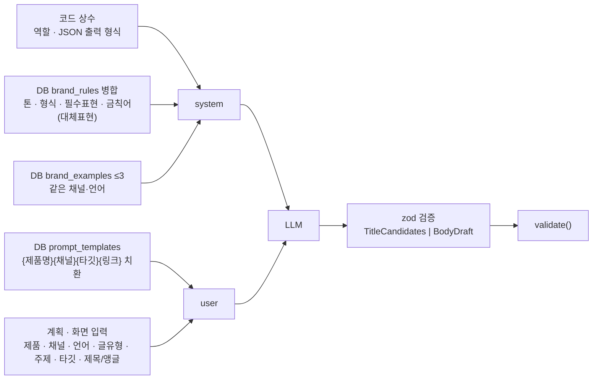

# 기술 요구사항 (TRD)

> PRD 의 FR 번호를 기술 명세로 옮긴다. API 계약의 단일 출처는 `API_SPEC.md`, 결정의 배경은 `ADR.md`, 구조는 `ARCHITECTURE.md` 다.
> 숫자로 적는다 — 숫자가 없으면 게이트가 검사할 것이 없다.

## 1. 개요 (Scope & Context)

**정하는 것.** 스택과 그 근거, FR 별 기술 명세, 데이터 스키마(영문 매핑), 비기능 숫자, 외부 의존성의 타임아웃·재시도·실패 시 동작, 테스트 범위, 배포·비밀값·실행 시간 예산, 부채 목록.

**안 정하는 것.** 화면 디자인(`UI_GUIDE.md`), 요청·응답 스키마 세부(`API_SPEC.md`), 왜 그렇게 골랐는지의 트레이드오프(`ADR.md`).

**범위 경계.**

| 단계 | 내용 | 기한 |
|---|---|---|
| MVP (Must) | 콘텐츠 생성 파이프라인 FR-001~016 | 2026-09-17 |
| Should | 원가표·원가손익·환율 크론·광고 성과·시트 웹훅·브랜드 기준 화면 FR-020~025 | 인터뷰 후 |
| Could | 콘텐츠 성과·규칙 편집 UI·필리핀어·채널 API·자동 발행·키워드 관리 FR-030~035 | 미정 |

하네스 어댑터는 **`nextjs-ts`** 다. `harness/config.json` 은 템플릿 상태(`self-python`)이므로 코드 작업 전에 `python scripts/harness.py init --adapter nextjs-ts --name banana-island-ops --force` 로 교체하고 `roles[].owns` 에 `drizzle/**` 를 더한다(§9).

## 2. 기술 스택

| 계층 | 선택 | 버전 기준 | 선택 근거 |
|---|---|---|---|
| 프레임워크 | Next.js App Router | 15.x 이상 안정판 | Vercel 배포와 가장 마찰이 적다. 페이지(서버 컴포넌트)와 Route Handler 가 한 리포에 있어 4일 안에 화면 9개 + API 를 낼 수 있다. 하네스 어댑터 `nextjs-ts` 가 이미 있다 (ADR-001) |
| 언어 | TypeScript `strict: true` | 5.x | 계약 추적(`contract-trace`)이 심볼 실재를 대조하려면 타입이 있어야 한다 |
| 런타임 | Node.js 22 LTS (Vercel 기본) | `@types/node` 22.x | Anthropic SDK · googleapis 가 Node 런타임을 요구한다. Edge 런타임은 쓰지 않는다. Node 20 은 2026-04 EOL 이고 vitest 5 가 `@types/node` 22 이상을 요구한다 |
| DB | Neon Postgres (서버리스) | — | 사용자 결정. 브랜치·무료 티어·Vercel 통합 |
| ORM | Drizzle ORM + `drizzle-kit` + `@neondatabase/serverless` HTTP 드라이버 | 최신 안정판 | 서버리스는 연결 풀을 못 들고 다니므로 HTTP 드라이버가 맞다. 스키마가 TS 라 계약의 「데이터 형태」와 같은 언어다. HTTP 모드는 다중 문 트랜잭션이 없다 — 상태 전이는 단일 UPDATE 로 설계해 회피 (ADR-002) |
| 스키마 검증 | zod | 3.x | 외부 응답(LLM JSON·시트 행·환율)을 신뢰 경계에서 걸러야 한다(CLAUDE.md CRITICAL). API 요청 검증에도 같은 스키마를 쓴다 |
| LLM | `@anthropic-ai/sdk` | 최신 | 사용자 결정. `LlmClient` 인터페이스 뒤에 두어 교체 가능 (ADR-003). 모델 ID 는 `env.ts` 의 `LLM_MODEL` 로 주입하고 콘텐츠 행에 기록 |
| 시트 | `googleapis` (Sheets v4, 서비스 계정 JWT) | 최신 | 읽기 전용 스코프 `spreadsheets.readonly`. Apps Script 푸시는 같은 동기화 함수를 부르는 웹훅 (ADR-006) |
| 환율 | Frankfurter API (ECB) | — | 키 불필요, USD·PHP·KRW 지원. 실패 시 수동 입력 폴백 (ADR-010) |
| 스타일 | 글로벌 CSS 변수 + CSS Modules, Pretendard(CDN) | — | 목업 CSS 를 그대로 이식한다. Tailwind 등 새 의존성 없음 (ADR-013) |
| 테스트 | Vitest + `@vitest/coverage-v8` + junit 리포터 | 최신 | 어댑터가 `reports/junit/*.xml` 을 읽어 테스트 수를 센다 |
| 린트 | ESLint (`eslint-config-next`) | — | 어댑터 `lint` 스테이지 |
| 배포 | Vercel Hobby + Vercel Cron 1개 | — | 사용자 결정. 함수 상한 300초 고정 (§9) |

`package.json` 스크립트 이름은 어댑터가 찾는 이름으로 고정한다: `dev` · `typecheck` · `lint` · `test` · `build`.

## 3. 시스템 요구사항 (Functional → Tech Spec)

| FR | 기술 명세 | 위치 |
|---|---|---|
| FR-001 | `syncPlansFromSheet(sheets: SheetsClient, trigger)` — `SHEET_RANGE` 를 읽어 행을 `SheetPlanRow` zod 로 검증(§4 「시트 행 계약」) → `sheet_row_key` 기준 `INSERT … ON CONFLICT DO UPDATE` → 이번 읽기에 없는 기존 키는 `on_hold=true` → `import_logs` 1행(전체/성공/실패/오류 상세 jsonb). 검증 실패 행과 채널·제품·언어·글유형 불일치 행은 건너뛰고 `SheetRowError` 로 오류 상세에 남긴다. 담당자는 `users.name` 정확 일치, 실패 시 NULL | `services/plan-sync.ts`, `lib/sheets.ts` |
| FR-002 | `listPlans(month)` 가 `publish_plans LEFT JOIN contents` 로 읽고 `derivePlanStatus(plan, content)` 순수 함수가 상태를 계산한다. 캘린더는 `scheduled_date` 로 그룹 | `services/plans.ts`, `lib/plan-status.ts` |
| FR-003 | `resolveRules({channelId, lang, productId})` — `brand_rules WHERE status='active' AND (scope='common' OR (scope='country' AND country=채널.국가) OR (scope='channel' AND channel_id=…) OR (scope='product' AND product_id=…))` 를 읽고 `mergeRules(rows)` 순수 함수로 병합: `ban`·`must` 는 합집합(중복은 규칙 id 로 제거), `tone`·`format`·`persona` 는 scope 우선순위 product > channel > country > common 으로 하나만. 응답에 `appliedRuleIds[]`·`version` 포함 | `services/rules.ts`, `lib/rules-merge.ts` |
| FR-004 | `generateTitles(llm, input)` — system = 역할·JSON 출력 형식(코드 상수) + 병합 규칙; user = 제품·채널·언어·글유형·주제·타깃. 출력 zod `TitleCandidates { items: [{title, angle}] × 3 }`. 각 제목에 `validate()` 를 돌려 차단이면 그 항목만 1회 재요청. 저장 없음. 타임아웃 20초 | `services/content-generation.ts`, `lib/llm/prompts.ts` |
| FR-005 | `createContentWithBody(llm, input)` — ① `contents` INSERT(`status='draft'`, 제목·제목후보·타깃·계획 연결) ② `buildUtmLink(contentId, channel)` ③ `prompt_templates` 에서 채널 템플릿(없으면 공통) 읽어 `{제품명}{채널}{타깃}{링크}` 치환 ④ `brand_examples WHERE channel_id, lang, is_active ORDER BY created_at DESC LIMIT 3` 을 few-shot 으로 system 에 붙임 ⑤ LLM 호출(타임아웃 45초, 출력 zod `BodyDraft { body }`) ⑥ `validate()` → 차단 있으면 대체표현 피드백을 user 에 덧붙여 1회 재호출 ⑦ UPDATE `body, sent_prompt, rule_snapshot{ruleIds, version, exampleIds}, detected_terms, model, regen_count`. 실패 시 행은 `draft` 로 남고 `LLM_FAILED`/`LLM_TIMEOUT` | `services/content-generation.ts`, `lib/utm.ts` |
| FR-006 | `validate(text, rules): ValidationResult { blocks[], warns[], missing[] }` — 규칙마다 `new RegExp(detect_pattern, 'giu')` 로 전 매치, 필수표현은 소문자 포함 검사. 순수 함수, 골든 테스트 대상. 하드 룰만 코드가 검사하고 톤·형식은 사람이 본다 (ADR-008) | `lib/validator.ts` |
| FR-007 | `regenerate(llm, contentId, instruction)` — 현재 본문을 `content_history` 로 복사(`reason='regenerate'`) 후 FR-005 ⑤~⑦ 재실행(instruction 을 user 끝에 추가). `regen_count += 1`. 상태는 `draft` 유지(`rejected` 면 `draft` 로). `title`이 오면 지시문 경로 대신 FR-005 초안 생성과 같은 제목·앵글 기반 프롬프트로 본문을 새로 만들고 `title`·`titleCandidates`도 갱신한다 — 이 제목-분기와 `createContentWithBody`의 초안 생성 경로는 템플릿 조회·렌더링·브랜드 예시 조회·프롬프트 조립·LLM 호출(예산)·FR-006 자동 재생성을 `buildBodyDraft` 공용 헬퍼로 공유한다(같은 콘텐츠 행 UPDATE, 새 행 없음 — ADR-007) | `services/content-generation.ts` |
| FR-008 | `editContent(contentId, {title?, body?})` — 이력 저장(`reason='manual_edit'`) → UPDATE → `validate()` 재실행 → 결과 반환. `published` 는 거부(409) | `services/content-workflow.ts` |
| FR-009 · FR-010 · FR-011 · FR-013 | `transition(contentId, action, actor)` 하나가 상태 기계 표를 보고 허용 여부·다음 상태·부수효과(계획 연결 이전, 예시 등록, 이력, 시각 컬럼)를 처리한다. 표에 없는 조합은 `INVALID_TRANSITION`. admin 전용 액션은 `actor.role !== 'admin'` 이면 `FORBIDDEN_ROLE`. `submit` 은 `detected_terms.blocks.length === 0` 필수(`BLOCKED_TERMS_REMAIN`) | `services/content-workflow.ts` |
| FR-014 | `createNewVersion(contentId)` — `transition()` 은 "조회한 행을 그대로 UPDATE" 라는 불변식이라 "원본은 안 바꾸고 새 행을 만든다"는 이 요구와 모양이 달라 `TRANSITIONS` 표 밖의 별도 함수로 둔다(`approveContent()`·`statusAfterEdit` 와 같은 선례). `published` 원본의 `publish_plan_id` 를 낙관적 잠금으로 비우고 그 값으로 새 `draft` 행(`source_content_id`=원본 id, 본문·전송 프롬프트·규칙 스냅샷 복사, 제목에 " (v2)")을 INSERT. 원본은 `published` 그대로 잠긴 채 남는다 | `services/content-workflow.ts` |
| FR-010 예시 등록 | `approve` 에 `registerAsExample=true` 면 `warns.length === 0` 일 때만 `brand_examples` INSERT(`summary` = 본문 앞 800자, `reason='admin_approval'`, `evidence=null`). 경고가 있으면 승인은 하되 응답에 `exampleRegistered:false, reason` | 같은 파일 |
| FR-012 | `formatForChannel(content, channel)` 순수 함수 — 인스타: 해시태그 세트 + 「프로필 링크」, 아마존: 그대로, 블로그류: 본문에 UTM 없으면 끝에 추가 | `lib/channel-format.ts` |
| FR-013 URL 확인 | `checkUrl(url)` — `fetch(url, {method:'HEAD', signal: 5s})` → `ok | unreachable`. URL 없으면 `skipped`. `unreachable` 이면 전이를 막는다(422 `URL_UNREACHABLE`) — `contents.url_check` 는 기록하지 않는다(전이 자체가 실패). `ok`/`skipped` 는 `contents.url_check` 에 저장하고 전이한다. 발행 자체는 수동 (ADR-009) | `lib/url-check.ts` |
| FR-015 | `POST /api/role` 이 `role=editor|admin` 을 `httpOnly; SameSite=Lax` 쿠키로 설정. `getActor(request)` 가 쿠키를 읽어 `{role, userId}` 반환(시드 사용자 2명에 고정 매핑) | `lib/role.ts` |
| FR-016 | 홈 집계는 서버 컴포넌트가 `services/dashboard.ts` 로 읽는다 (이번 달 `published` 수 / `in_review` 목록 / `approved` 목록 / 광고 요약은 Should 전까지 빈 상태) | `app/page.tsx` |
| FR-020 | `cost_sheets` + `cost_items` CRUD. `status='draft'` 만 편집, `confirm` 은 `confirmed_at` 기록 후 잠금, `clone` 은 항목 복사 | `services/cost.ts` |
| FR-021 | `calcUnitCost({sheet, channel, fx})` 순수 함수 — 항목별 개당 = 금액 ÷ (배치당이면 배치수량, 아니면 1); 원화 = PHP×fx.php, KRW×1, USD×fx.usd; 판매 단계 = 판매가(원화)×`fee_rate`; 개당 원가 = Σ; 마진 = 판매가 − 원가; 마진율 = 마진/판매가; BEP = ceil(고정비/마진), 마진 ≤ 0 이면 `null`. 시뮬레이션은 저장하지 않고, `구분='actual'` 만 `cost_calc_results` 에 적용 환율과 함께 저장 | `lib/cost-calc.ts` |
| FR-022 | `refreshFx(fxClient, date)` — Frankfurter `latest?from=USD&to=KRW,PHP` 1회 호출 → USD→KRW 직접, PHP→KRW = (USD→KRW)/(USD→PHP) 계산 → 2행 upsert(`source='api'`). 크론 라우트는 `Authorization: Bearer ${CRON_SECRET}` 검사. `getFx(date)` 는 그 날짜 이하 최신 행을 돌려주고 `staleDays` 를 함께 준다 | `services/fx.ts`, `lib/fx-client.ts` |
| FR-023 | `ad_performance` 입력(월 단위 기간 고정, `(channel_id, period_start, period_end)` upsert, `input_source='manual'`) + 조회 시 `fx_rates` 로 원화 환산, `roas = revenue/spend` | `services/ads.ts` |
| FR-024 | `POST /api/plans/webhook` — 헤더 `X-Sheet-Secret` 이 `SHEET_WEBHOOK_SECRET` 와 같을 때만 FR-001 을 `trigger='webhook'` 으로 실행. Apps Script 쪽은 `onEdit` 디바운스(마지막 편집 후 60초) — 리포 밖 문서로 남긴다 | `app/api/plans/webhook/route.ts` |
| FR-025 | 서버 컴포넌트가 `listBrandStandards()` 로 `brand_rules`(active)·`sales_channels`·`products` 를 읽고, 순수 함수 `buildBrandStandards()` 가 채널별로 `mergeRules` 를 재사용해 채널별 기준·금칙어·필수 표현·제품 범위 예외 표로 조립 | `app/rules/page.tsx`, `services/rules.ts`, `lib/rules-merge.ts` |

### 프롬프트 조립 규칙 (FR-004·005 공통)

1차(제목)·2차(본문)는 같은 system 을 공유한다. 두 호출 모두 JSON 만 출력하도록 지시하고, 파싱 실패는 1회 재시도 후 `LLM_FAILED`.

### UTM 링크 규칙 (FR-005)

`${PRODUCT_BASE_URL}/product/${product.product_code}?utm_source=${channel.utm_source}&utm_medium=${channel.utm_medium}&utm_campaign=c-${content.id}`. 제품이 없으면 `${PRODUCT_BASE_URL}` 루트. `sales_channels.link_policy` 가 `none`(인스타·아마존)이면 링크를 본문에 넣지 않고 화면에만 보여준다.

## 4. 데이터 설계

원본은 Miro ERD v7 (`https://miro.com/app/board/uXjVHo6_7_E=/`). 식별자는 영문 snake_case(ADR-012). `id` 는 `bigserial`, 시각은 `timestamptz`, 금액은 `numeric(14,4)` + `currency char(3)`, enum 은 `pgEnum`.

### 테이블 매핑 (17개)

| ERD | 테이블 | 주요 컬럼 (ERD 그대로 영문화) | 키·인덱스 |
|---|---|---|---|
| 사용자 | `users` | `email` UK, `name`, `role` enum(`admin`,`editor`,`viewer`) | — |
| 제품 | `products` | `product_code` UK, `name`, `weight_g`, `price_krw`, `price_usd`, `is_active` | — |
| 판매채널 | `sales_channels` | `channel_code` UK, `name`, `country` char(2), `currency`, `lang` enum(`ko`,`en`), `distribution_route` enum(`kr_domestic`,`us_export`,`ph_local`), `fee_rate`, `publish_method` enum(`manual`,`api`), `tracking_method` enum(`utm_ga4`,`nt_smartstore`,`amazon_attribution`,`redirect`), **`kind` enum(`sales`,`content`)** (ADR-011), `utm_source`, `utm_medium`, `link_policy` enum(`inline`,`bio`,`none`), `write_url`, `persona`, `tone`, `format` | — |
| 브랜드규칙 | `brand_rules` | `scope` enum(`common`,`country`,`channel`,`product`), `country`, `channel_id` FK, `product_id` FK, `rule_type` enum(`ban`,`must`,`tone`,`format`,`persona`), `lang`, `content`, `detect_pattern`, `alternative`, `reason`, `legal_basis`, `severity` enum(`block`,`warn`), `status` enum(`draft`,`active`,`retired`), `version`, `created_by` FK, `approved_by` FK, `effective_from` | idx `(status, scope, lang)` |
| 브랜드규칙이력 | `brand_rule_history` | `rule_id` FK, `changed_by` FK, `change_type`, `before` jsonb, `after` jsonb, `reason` | — |
| 브랜드예시 | `brand_examples` | `content_id` FK, `channel_id` FK, `lang`, `summary` (앞 800자), `reason` enum(`admin_approval`,`high_conversion`,`repeated_edit`), `evidence` jsonb, `is_active` | idx `(channel_id, lang, is_active)` |
| 프롬프트템플릿 | `prompt_templates` | `channel_id` FK nullable, `name`, `lang`, `body`, `version`, `is_active` | idx `(channel_id, lang, is_active)` |
| 발행계획 | `publish_plans` | `import_id` FK, `sheet_row_key` UK, `scheduled_date`, `channel_id` FK, `product_id` FK nullable, `lang` enum(`ko`,`en`), `post_type` enum(`health_info`,`activity_news`,`comparison`,`review`), `topic_memo`, `owner_id` FK nullable, `on_hold` bool, `updated_at` | idx `(scheduled_date)` |
| 콘텐츠 | `contents` | `publish_plan_id` FK **UNIQUE nullable**, `source_content_id` FK nullable, `product_id` FK nullable, `channel_id` FK, `template_id` FK, `author_id` FK, `reviewer_id` FK, `publisher_id` FK, `lang`, `target_persona`, `status` enum(`draft`,`in_review`,`approved`,`rejected`,`published`), `title`, `title_candidates` jsonb, `body`, `regen_count`, `rule_snapshot` jsonb, `detected_terms` jsonb, `sent_prompt`, `model`, `reject_reason`, `published_url`, `url_check` enum(`ok`,`unreachable`,`skipped`) nullable, `submitted_at`, `reviewed_at`, `published_at`, `updated_at` | idx `(status, updated_at desc)`, `(author_id)` |
| 콘텐츠이력 | `content_history` | `content_id` FK, `version_no`, `reason` enum(`regenerate`,`rejected_edit`,`manual_edit`,`submit`), `title`, `body`, `sent_prompt`, `detected_terms` jsonb, `changed_by` FK | idx `(content_id, version_no)` |
| 콘텐츠성과 | `content_performance` | `content_id` FK, `import_id` FK, `source` enum, `period_start`, `period_end`, `clicks`, `orders` nullable, `revenue`, `currency` | UK `(content_id, source, period_start, period_end)` — Could, 스키마만 |
| 환율 | `fx_rates` | `rate_date`, `base` char(3), `quote` char(3), `rate` numeric(18,8), `source` enum(`api`,`manual`) | UK `(rate_date, base, quote)` |
| 원가표 | `cost_sheets` | `product_id` FK, `distribution_route` enum, `name`, `effective_from`, `status` enum(`draft`,`confirmed`), `confirmed_at`, `note` | idx `(product_id, distribution_route, status)` |
| 원가항목 | `cost_items` | `cost_sheet_id` FK, `stage` enum(`ph`,`kr`,`us`), `cost_kind`, `amount`, `currency`, `basis` enum(`per_unit`,`per_batch`), `batch_qty`, `note` | — |
| 원가계산결과 | `cost_calc_results` | `cost_sheet_id` FK, `channel_id` FK, `fx_php`, `fx_usd`, `unit_cost_krw`, `price_krw`, `margin_rate`, `fixed_cost_krw`, `bep_qty`, `kind` enum(`actual`,`simulation`), `calculated_at` | — |
| 광고성과 | `ad_performance` | `channel_id` FK, `product_id` FK nullable, `content_id` FK nullable, `import_id` FK, `period_start`, `period_end`, `spend`, `revenue`, `orders`, `currency`, `input_source` enum(`csv`,`manual`,`sheet`,`api`) | UK `(channel_id, period_start, period_end)` |
| 가져오기이력 | `import_logs` | `executed_by` FK nullable, `target` enum(`ad_performance`,`content_performance`,`cost_items`,`publish_plans`), `input_source` enum, `source_ref`, `total_rows`, `ok_rows`, `failed_rows`, `errors` jsonb | idx `(target, created_at desc)` |

모든 테이블에 `created_at timestamptz default now()`.

### ERD 에서 바뀐 것

- `sales_channels.kind` 추가 — 목업의 발행 채널(네이버 블로그·인스타그램·Shopify 블로그·Amazon 상세)과 판매 채널 6개를 한 테이블에 둔다. 규칙·계획·콘텐츠가 참조하는 채널과 광고·원가가 참조하는 채널이 같은 FK 를 쓴다 (ADR-011).
- `sales_channels.utm_source/utm_medium/link_policy/write_url/persona/tone/format` 추가 — 목업 `CH` 객체의 채널 속성. 톤·형식·타깃은 규칙 테이블(`scope='channel'`)로도 표현 가능하지만 MVP 시드는 채널 컬럼을 기본값으로 쓰고 규칙이 덮어쓴다.
- `contents.url_check` 추가 — FR-013 의 HEAD 결과.
- 콘텐츠 상태 이름을 영문 enum 으로: `초안=draft · 검수대기=in_review · 승인=approved · 반려=rejected · 발행완료=published`.

### 시드 (마이그레이션 뒤 `npm run seed`)

| 테이블 | 행 | 출처 |
|---|---|---|
| `users` | 2 — 대표(admin) · 마케팅 담당(editor) | 목업 `ME`, 역할 매핑 |
| `products` | 3 — 그린바나나가루 300g · 글루텐프리 베이킹 믹스 150g · 그린바나나 파운드케이크 | 목업 `PRODUCTS` |
| `sales_channels` | 6 sales(스마트스토어·쿠팡·아름다운커피·닥다몰·Amazon US·Shopee PH) + 4 content(네이버 블로그·인스타그램·Shopify 블로그·Amazon 상세) | 목업 `channels`·`CH`, 사업계획서 |
| `brand_rules` | ko 차단 2·경고 1·필수 2, en 차단 1·경고 1·필수 2, 제품 범위(베이킹 믹스: 타깃·슈가프리) | 목업 `RULES`·`PRODUCT_RULES` |
| `prompt_templates` | 채널별 4 (ko 2, en 2) | 목업 `submitForReview` 의 프롬프트 |
| `cost_sheets`·`cost_items` | 4 표 (한국내수 2·미국수출 1·필리핀현지 1) | 목업 `COST_SHEETS` |
| `fx_rates` | 오늘 2행 (PHP 24.40, USD 1378, `manual`) | 목업 `FX` |

### 시트 행 계약 (`SheetPlanRow`, FR-001)

PRD Q1 의 답(2026-09-13)이다. **헤더 1행, 데이터는 2행부터, 열 순서 A~H 고정.** `SHEET_RANGE` 는 `{탭}!A2:H` 꼴이고 탭 이름은 환경변수 값이 정한다. 이 소절이 시트 열의 단일 출처다 — PRD §0 은 이것을 요약한다.

| 열 | 헤더 | 필수 | 입력 방식 | → `publish_plans` | 규칙 |
|---|---|---|---|---|---|
| A | 계획ID | 필수 | 사람이 적음 (예 `P-2026-09-001`) | `sheet_row_key` | trim 뒤 비어 있지 않음. 시트 안에서 유일 |
| B | 발행예정일 | 필수 | 날짜 셀, 표시 형식 `YYYY-MM-DD` | `scheduled_date` | `FORMATTED_VALUE` 로 읽어 `^\d{4}-\d{2}-\d{2}$` 검사 |
| C | 채널 | 필수 | 드롭다운 = `sales_channels.name` (`kind='content'` 4개) | `channel_id` | name 정확 일치. 불일치·빈값 → 행 건너뜀 |
| D | 제품명 | 선택 | 드롭다운 = `products.name` 3개 | `product_id` | 빈값 → NULL(브랜드 소식형). 값이 있는데 불일치 → 행 건너뜀 |
| E | 언어 | 필수 | 드롭다운 `ko` / `en` | `lang` | 그 둘 외 → 행 건너뜀 |
| F | 글유형 | 필수 | 드롭다운 4개 (아래 대응표) | `post_type` | 대응표 밖 → 행 건너뜀 |
| G | 주제·메모 | 선택 | 자유 텍스트 | `topic_memo` | 빈값 → `''` |
| H | 담당자 | 선택 | 자유 텍스트 | `owner_id` | `users.name` 정확 일치, 실패·빈값 → NULL |

필수 5 는 `publish_plans` 의 NOT NULL 컬럼(`sheet_row_key` · `scheduled_date` · `channel_id` · `lang` · `post_type`)과 1:1 이고, 선택 3 은 nullable 이거나 빈 문자열이 허용되는 컬럼이다. 열은 이보다 늘리지 않는다.

**글유형 대응표.** 건강정보형 → `health_info` · 활동소식형 → `activity_news` · 비교큐레이션형 → `comparison` · 후기리뷰형 → `review`.

**정규화는 trim 뿐이다.** 드롭다운 값이라 대소문자·공백 변형을 흡수하지 않는다. 흡수하면 시드와 시트가 조용히 갈라진다.

**행 단위 판정.**
- 8칸이 전부 빈 행은 무시하고 `totalRows` 에 세지 않는다
- 같은 계획ID 가 두 번 나오면 뒤 행을 `DUPLICATE_KEY` 로 건너뛴다
- 건너뛴 행은 `import_logs.errors` 와 `SyncResult.errors` 에 `{ row, column?, reason }` 로 남는다. `row` 는 시트 행 번호(헤더 = 1), `column` 은 열 문자
- 건너뛴 행의 키가 이미 DB 에 있으면 그 계획은 **그대로 둔다** — 이번 읽기에 있었던 키이므로 `on_hold` 로 넘기지 않는다

**오류 어휘 `SheetRowError`** (닫힌 집합, `API_SPEC.md` 와 같다): `MISSING_REQUIRED` · `INVALID_DATE` · `UNKNOWN_CHANNEL` · `UNKNOWN_PRODUCT` · `UNKNOWN_LANG` · `UNKNOWN_POST_TYPE` · `DUPLICATE_KEY`.

**책임 분리.** `SheetPlanRowSchema`(zod, `lib/schemas.ts`)는 **형태**만 본다 — 계획ID 비어 있지 않음 · 날짜 정규식 · 언어 enum · 글유형 레이블 enum · 나머지 string. 이름 → id **조회**(채널·제품·담당자)는 `services/plan-sync.ts` 가 파싱 뒤에 한다. 조회 실패도 같은 `errors` 로 나간다.

**읽기.** `lib/sheets.ts` 의 `readRows(range): Promise<string[][]>` — `valueRenderOption: 'FORMATTED_VALUE'`, 8칸 미만 행은 `''` 로 채운다.

## 5. API 설계

계약의 단일 출처는 `API_SPEC.md` 다. 요약만.

- 베이스 `/api`, JSON, 성공 `{ data }`, 실패 `{ error: { code, message, details? } }`.
- 읽기는 `GET`, 상태 전이는 `POST /api/contents/{id}/{action}` 로 액션마다 라우트 하나(계약의 진입점이 명확해진다).
- Must 라우트 19개, Should 라우트 8개. 에러 어휘 10개 닫힌 집합.
- 진입점 파일 규약은 어댑터 `entrypoint_resolver` 그대로: `/api/{p}` → `src/app/api/{p}/route.ts`, export `GET|POST|PATCH`.

## 6. 비기능 요구사항 (Non-Functional Requirements)

### 성능 · 시간 예산

| 항목 | 기준 | 어디서 강제 |
|---|---|---|
| 제목 3안 생성 (`POST /api/contents/titles`) | p95 ≤ 15초, 라우트 `maxDuration = 30` | Anthropic 타임아웃 20초 |
| 본문 생성·재생성 | p95 ≤ 45초, 라우트 `maxDuration = 60` (자동 재생성 1회 포함) | Anthropic 타임아웃 45초, 재생성 포함 시 합산 55초 상한 |
| 규칙 조회 `GET /api/rules/resolve` | p95 ≤ 500ms | 단일 쿼리 + 메모리 병합 |
| 시트 동기화 | p95 ≤ 10초 (행 ≤ 500) | Sheets 타임아웃 10초, `maxDuration = 30` |
| 페이지 TTFB (서버 컴포넌트 읽기) | ≤ 1.5초 | Neon 리전을 Vercel 함수 리전과 맞춘다(§9) |
| 발행 URL HEAD | ≤ 5초 | `AbortSignal.timeout(5000)` |
| Vercel 함수 상한 | 300초 (Hobby 고정) | 위 예산은 전부 이 안에 있다 |

### 관측성

- 모든 LLM 호출을 구조화 JSON 한 줄로 남긴다: `{event:'llm_called', purpose, model, input_tokens, output_tokens, latency_ms, ok, content_id?}`.
- 외부 호출 실패는 `{event:'external_failed', target, code, message}` 로 남기고 응답 원문은 2KB 까지 붙인다.
- 상태 전이는 `content_history` + 로그 `content_state_changed`.
- 보는 곳: Vercel 함수 로그. 별도 APM 없음(부채 #5).

### 보안

- 비밀값은 `src/lib/env.ts` 하나가 zod 로 읽고 없으면 부팅 실패. 코드 어디서도 `process.env` 를 직접 읽지 않는다.
- 역할 쿠키는 `httpOnly; SameSite=Lax; Secure(프로덕션)`. admin 전용 라우트는 `getActor()` 로 서버에서 검사한다. 인증은 없다(ADR-004) — 외부 공개 전에 도입한다.
- 원가·광고 데이터 라우트(`/api/cost-sheets`, `/api/cost/calc`, `/api/ads`)는 admin 만. 사업계획서 3-3 「원가·재무 자료는 인가자만」.
- 크론·웹훅 라우트는 각각 `CRON_SECRET`·`SHEET_WEBHOOK_SECRET` 헤더 검사.
- LLM 에 보내는 데이터에 개인정보 없음(제품·규칙·주제만). 발행 URL 은 HEAD 만 하고 본문을 읽지 않는다.
- `npm audit --audit-level=high` 가 게이트(어댑터 `check`).

### 접근성

- 모든 인터랙티브 요소에 `:focus-visible` 링, 토글은 `aria-pressed`, 현재 탭은 `aria-current="page"` (목업 그대로).
- 상태는 색 + 텍스트 태그를 병기한다. 색만으로 구분하는 요소 0개.
- `prefers-reduced-motion` 에서 페이지 전환 애니메이션 없음.

## 7. 외부 의존성 & 장애 격리

| 의존성 | 용도 | 타임아웃 | 재시도 | 죽었을 때 |
|---|---|---|---|---|
| Anthropic API | 제목·본문 생성 | 제목 20초 · 본문 45초 | JSON 파싱 실패 1회, 네트워크 오류 0회 | `LLM_FAILED`(502) 또는 `LLM_TIMEOUT`(504). 콘텐츠 행은 `draft` 로 보존, 입력값은 화면에 남는다. 다른 기능(계획·검수·발행)은 영향 없음 |
| Google Sheets API | 발행 계획 읽기 | 10초 | 0회 | `SHEET_FETCH_FAILED`(502). 기존 계획 유지, 마지막 동기화 시각 표시. `import_logs` 에 실패 행 기록 |
| Frankfurter API | 환율 | 5초 | 0회 (다음 날 크론이 다시) | 전일 값 유지, `staleDays` 로 경고. 수동 입력 가능. 원화 환산이 필요한 화면은 「n일 전 환율」 표시 |
| Neon Postgres | 전부 | 드라이버 기본 | 0회 | 500 `INTERNAL`. 격리 불가 — 이 의존성은 단일 장애점이다 |
| 발행 URL (임의 사이트) | HEAD 확인 | 5초 | 0회 | 전이 차단(422 `URL_UNREACHABLE`), 담당자가 URL 을 고치거나 지운 뒤 재시도 |
| Pretendard CDN | 폰트 | — | — | 시스템 폰트 폴백(`font-family` 스택) |

외부 클라이언트는 전부 인터페이스(`LlmClient` · `SheetsClient` · `FxClient` · `UrlChecker`)로 주입되어 테스트에서 모킹한다(§8). 서비스 함수는 클라이언트를 인자로 받는다 — 전역 싱글턴을 import 하지 않는다.

## 8. 테스트 전략

| 층 | 대상 | 도구 | 기준 |
|---|---|---|---|
| 순수 함수 (골든) | `lib/validator.ts`, `lib/rules-merge.ts`, `lib/plan-status.ts`, `lib/cost-calc.ts`, `lib/channel-format.ts`, `lib/utm.ts` | Vitest, `*.golden.test.ts` — 입력·기대 출력 표 | 분기 커버리지 100%. 검증기는 목업 `RULES` 의 ko/en 문장 세트(차단·경고·누락·통과 각 ≥3) |
| 서비스 | `services/*.ts` | Vitest, 외부 클라이언트 모킹(계약 「외부 경계」 시그니처) + Neon 은 **테스트용 Neon 브랜치** 또는 `pglite` 인메모리 | 라인 커버리지 ≥ 80%. 상태 기계는 허용·거부 전이 전수 |
| 라우트 | `app/api/**/route.ts` | Vitest 로 `Request` 를 만들어 핸들러 직접 호출 | 요청 검증 400 · 역할 403 · 전이 409/422 · 성공 경로 각 1 |
| E2E | — | 없음 (어댑터 `e2e: null`, 스킵됨으로 기록) | 인터뷰 시연 시나리오(PRD §7)를 손으로 1회 |

- 리포터: `vitest run --reporter=default --reporter=junit --outputFile=reports/junit/report.xml`. 어댑터가 테스트 수를 센다.
- 계약의 유닛은 위 함수 이름을 그대로 쓴다. 테스트 파일은 `src/**/*.test.ts` 로 test 역할 소유.
- 외부 API 실 호출 테스트는 없다. 키가 없는 환경(하네스 `infra_preflight`)에서도 전체 테스트가 돈다.

## 9. 배포 & 인프라

**대상.** Vercel Hobby, 프로젝트 1개, 프로덕션 브랜치 `main`, 프리뷰는 `feat-*` 브랜치 자동. Neon 프로젝트 1개(`main` 브랜치 = 프로덕션, PR 별 브랜치는 Should).

**리전.** Vercel 함수 리전 `icn1`(서울) 에 맞춰 Neon 은 가장 가까운 리전(Singapore `ap-southeast-1`)으로 만든다. 왕복 지연이 §6 TTFB 예산의 근거다.

**비밀값·환경변수** — Vercel 환경변수로 주입, 로컬은 `.env.local`(gitignore 됨). `src/lib/env.ts` 가 전부 검증한다.

| 이름 | 용도 | 필수 |
|---|---|---|
| `DATABASE_URL` | Neon 연결 문자열 (pooled, HTTP) | Must |
| `ANTHROPIC_API_KEY` · `LLM_MODEL` | LLM | Must |
| `PRODUCT_BASE_URL` | UTM 링크 목적지 (`https://bisland.kr`) | Must |
| `GOOGLE_SERVICE_ACCOUNT_EMAIL` · `GOOGLE_PRIVATE_KEY` · `SHEET_ID` · `SHEET_RANGE` (예 `계획!A2:H`, §4 「시트 행 계약」) | 시트 읽기 | Must (없으면 동기화만 `SHEET_FETCH_FAILED`, 나머지 동작) |
| `CRON_SECRET` | 환율 크론 | Should |
| `SHEET_WEBHOOK_SECRET` | Apps Script 웹훅 | Should |

**실행 시간 상한.** 300초(Hobby, Fluid compute). 라우트별 `export const maxDuration` — 제목 30 · 본문/재생성 60 · 시트 동기화 30 · 나머지 기본 10. 큐·백그라운드 작업은 없다.

**크론.** `vercel.json` 에 `{"path":"/api/fx/refresh","schedule":"10 0 * * *"}` 1개(Hobby 는 일 1회 정밀도).

**마이그레이션.** 배포 파이프라인에서 돌리지 않는다. 스키마 변경 시 로컬에서 `npx drizzle-kit generate` → 리뷰 → `npx drizzle-kit migrate` 를 프로덕션 `DATABASE_URL` 로 실행 후 push. 순서를 지키지 않으면 배포된 코드가 없는 컬럼을 읽는다.

**하네스 설정 변경(코드 작업 전).** `harness/config.json` 을 `nextjs-ts` 프로필로 교체하고, `roles[impl].owns` 에 `drizzle/**`, `reviewers[data].when` 에 `src/lib/db/**` 를 더한다. 그 뒤 `doctor` → `calibrate`.

## 10. 리스크 & 기술 부채

부채는 세어야 부채다.

| # | 부채·리스크 | 왜 감수했나 | 갚는 조건 |
|---|---|---|---|
| 1 | **인증 없음** — 역할 쿠키는 누구나 바꿀 수 있다 | 4일·사내 3명·시연 | 외부 URL 공개 전 Auth.js 도입 (ADR-004) |
| 2 | Vercel Hobby 의 상업적 사용 제한 | 시연 단계 | 운영 전 Pro 전환 검토 (PRD Q4) |
| 3 | HTTP 드라이버라 다중 문 트랜잭션 없음 — 상태 전이 + 이력 + 예시 등록이 부분 실패할 수 있다 | 서버리스 단순성 | 실패가 관측되면 WebSocket 드라이버로 해당 서비스만 전환 (ADR-002) |
| 4 | 브랜드 규칙·템플릿 편집 UI 없음 (시드·SQL) | Could | US-031 |
| 5 | APM·알림 없음, Vercel 로그만 | 규모 | 월 15건 이상 운영 시 |
| 6 | 광고 성과·원가는 수동 입력, 채널 API 미연동 | 채널마다 API 유무·양식이 다름 | 채널별로 US-033 |
| 7 | 검증기는 정규식 — 어간 변형·띄어쓰기 변형을 놓친다 | 사람 검수가 최종 | 규칙 `detect_pattern` 을 원장(반려 사유)에서 보강 |
| 8 | 필리핀어 없음 | ko·en 우선 | US-032 |
| 9 | 콘텐츠 성과(GA4·NT·리다이렉트) 미구현, 스키마만 | 연동 비용 | US-030 |
| 10 | LLM 출력 스키마 위반율 미측정 | 첫 런 전 | 첫 런에서 `llm_called` 로그로 잰다 |
| 11 | ~~시트 컬럼 계약이 확정 안 됨~~ | — | **갚음 2026-09-13** — §4 「시트 행 계약」 |
