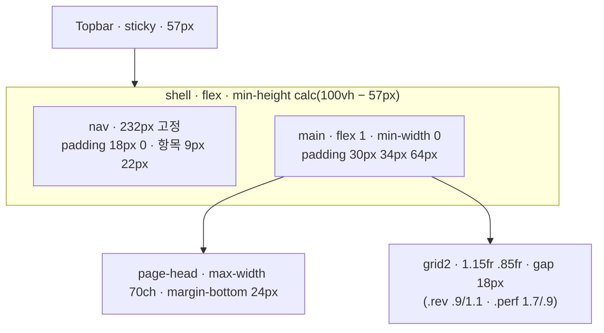

# UI 가이드

> 원본은 목업 `bananaislandops_2.html` 이다. 이 문서는 그 목업의 규칙을 글로 옮긴 것이고, 목업과 이 문서가 다르면 **이 문서**가 이긴다(목업은 갱신하지 않는다).
> 구현은 `src/app/globals.css`(토큰·리셋·공통 클래스) + CSS Modules. 절 제목은 지우지 않는다.

## 디자인 원칙

1. **숫자는 표로, 표는 tabular.** 이 도구의 화면 대부분은 숫자(ROAS·원가·건수)다. `font-variant-numeric: tabular-nums` 를 body 에 걸고, 숫자 셀은 `.num`(우측 정렬)이다. 그래프는 KPI 밴드의 3px 트랙과 표 안의 8px 바 두 가지뿐이다.
2. **출처를 항상 보이게.** 값이 어디서 왔는지(자동 수집 · 수동 입력 · 시트 · LLM 초안)를 색점(`.src`)과 라벨로 붙인다. 사용자가 무엇을 믿을지 가릴 수 있어야 한다.
3. **승인은 발행이 아니다.** 상태·버튼 문구가 이 구분을 지킨다. 「승인」 뒤에는 「발행 대기」가 오고, 「발행 완료」는 담당자가 누른다. 화면 어디에도 「자동 발행」이 활성화된 버튼은 없다.
4. **실패와 결과 없음은 다른 화면.** 실패는 `notice.bad`(원인 + 마지막 성공 시각 + 재시도), 결과 없음은 `empty`(다음 행동). 같은 문구를 두 상황에 쓰지 않는다.

## AI 슬롭 안티패턴 — 하지 마라

금지 목록을 먼저 둔다. 원칙보다 금지가 기계적으로 잡기 쉽다.

| 금지 | 대신 |
|---|---|
| 그라데이션 배경·글래스모피즘·그림자 카드 | 1px `--line` 테두리의 평면 패널. 그림자 0 |
| 이모지를 아이콘으로 | 텍스트 라벨. 아이콘이 꼭 필요하면 브랜드 마크(`BI`) 하나 |
| 큰 `border-radius`(카드 12px+) | `2px`(버튼·입력·칩) 또는 0(패널·표). 배지만 10px |
| 플레이스홀더 KPI (`—`, `0` 을 데이터처럼) | 값이 없으면 「데이터 없음 · 원인」을 쓴다. `0` 은 실제 0 일 때만 |
| 색만으로 상태 구분 | 색 + 텍스트 태그(`.tag`) 병기 |
| LLM 대기 중 빈 화면 또는 스피너만 | 진행 단계 문구(「규칙 재조회 → 프롬프트 조립 → 1차 호출」)와 예상 시간 |
| 실패를 빈 목록으로 | `notice.bad` + 마지막 성공 시각 |
| 「성공적으로 …되었습니다!」 식 감탄 토스트 | `notice.ok` 한 줄, 다음 행동 버튼 |
| 모달 위에 모달 | 반려 사유 입력도 인라인(`#rejectBox`) |
| 다크 모드 토글 UI | 시스템 설정을 따르되 토글은 없다 |
| 로렘 입숨·가짜 후기 | 시드는 목업 시드(실제 제품·채널명) |

## 색상

토큰으로 적는다. 라이트가 기본, 다크는 `@media (prefers-color-scheme: dark)` 로 같은 토큰을 덮어쓴다. 컴포넌트는 토큰만 쓰고 hex 를 직접 쓰지 않는다.

| 토큰 | 라이트 | 다크 | 쓰임 |
|---|---|---|---|
| `--ink` | `#1B2419` | `#ECEAE2` | 본문 글자, 상단바 배경(라이트) |
| `--paper` | `#F7F5EE` | `#171B16` | 페이지 배경 |
| `--surface` | `#FFFFFF` | `#1F241E` | 패널·표·입력 배경 |
| `--surface-2` | `#FCFBF7` | `#242A23` | 표 머리·hover 행·보조 박스 (목업의 `#FCFBF7`) |
| `--leaf` | `#2E5E3E` | `#7FB08D` | 주 강조(버튼·현재 탭·통과·발행 완료) |
| `--leaf-soft` | `#E7EEE6` | `#243128` | 선택 행·자동 적용 박스·승인 배경 |
| `--peel` | `#C9D96B` | `#C9D96B` | 브랜드 마크·상단바 강조·상승 |
| `--ripe` | `#B5851F` | `#D9A94A` | 주의(생성중·검수 대기·경고·수동 입력) |
| `--ripe-soft` | `#FAF3E2` | `#33301F` | 경고 배경·확인 박스 |
| `--clay` | `#A34B3C` | `#D98070` | 위험(반려·차단·낮은 ROAS·하락) |
| `--clay-soft` | `#F6E7E3` | `#3A2622` | 차단 배경·반려 박스 |
| `--muted` | `#6E7568` | `#9AA094` | 보조 글자·표 머리 |
| `--line` | `#DEDACF` | `#333A31` | 테두리·구분선·트랙 배경 |
| `--line-strong` | `#C4BFB1` | `#4A5247` | 입력 테두리·예정 상태 |
| `--sheet` | `#5B8DB8` | `#7FAAD0` | 시트 출처 색점 |
| `--topbar` | `var(--ink)` | `#0F120E` | 상단바 배경 |
| `--on-topbar` | `var(--paper)` | `#ECEAE2` | 상단바 글자 |

### 상태색 매핑 (태그·캘린더 이벤트·필터 칩 공통)

| 상태 | 콘텐츠/계획 | 테두리·점 | 배경 | 태그 클래스 |
|---|---|---|---|---|
| 예정 `scheduled` | 계획 | `--line-strong` | `#F4F2EB` / 다크 `--surface-2` | `.tag.hold` |
| 생성중 `generating` · 초안 `draft` | 둘 다 | `--ripe` | `#FDF9F0` | `.tag.ripe` |
| 검수 대기 `in_review` | 둘 다 | `--ripe` | `--ripe-soft` | `.tag.warn` |
| 승인 `approved` | 둘 다 | `--leaf` (outline) | `--surface` | `.tag.good` |
| 발행 완료 `published` | 둘 다 | `--leaf` | `--leaf-soft` (태그는 채움) | `.tag.done` |
| 반려 `rejected` | 콘텐츠 | `--clay` | `--clay-soft` | `.tag.warn` + 「콘텐츠 반려됨」 부제 |
| 보류 `on_hold` | 계획 | `--line-strong` + 취소선 | `#F4F2EB` | `.tag.off` |

출처 색점 `.src`: 자동 수집 `--leaf` · 수동 입력 `--ripe` · 시트 `--sheet` · 미연동은 `opacity:.6`.

## 컴포넌트

재사용 단위와 **네 가지 상태(빈 값 · 로딩 · 실패 · 결과 없음)** 를 함께 적는다. 상태를 안 적은 컴포넌트는 그 상태가 없는 것이다.

| 컴포넌트 | 형태 (목업 클래스) | 빈 값 | 로딩 | 실패 | 결과 없음 |
|---|---|---|---|---|---|
| **Topbar** | `.topbar` 브랜드 · 환율 레일 · 동기화 스탬프 · 역할 전환 | — | 레일에 「환율 불러오는 중」 | 「환율 · 09-11 기준 (2일 전)」 `.down` 색 | — |
| **Nav** | `.nav-item[aria-current]`, 검수함은 admin 만 `hidden` 해제, `.badge` 는 0 이면 숨김 | — | — | — | — |
| **Panel** | `.panel` > `.panel-head`(제목·`.panel-note`·우측 액션) > 본문 | — | 본문에 `.empty` 「불러오는 중」 | `.notice.bad` | `.empty` |
| **KpiBand** | `.kpi-band` 4열(2열 분기), `.kpi-now` + 단위 + 목표, 3px 트랙 + 목표 마커 | 「데이터 없음 · Should」 | 값 자리 「…」 | 「집계 실패」 | 실제 0 |
| **Table** | `th` 12px muted, 행 `.click`/`.sel`, `.num`, `.bar-cell`(8px 바 `low/mid`), `.sub` 부제 | — | 첫 행 「불러오는 중」 | `.notice.bad` 행 | `colspan` 한 행 「해당 상태의 콘텐츠가 없습니다」 |
| **Tag** | `.tag.{good,hold,warn,ripe,off}` 배경 없는 outline 텍스트(`border:1px solid currentColor`, radius 0, 색만 다름) · `.tag.done` 만 예외로 leaf 채움 + 흰 글자 | — | — | — | — |
| **Chip** | `.chip[aria-pressed]` 단일 선택 그룹(채널·언어·글 유형·필터), `.n` 카운트. 선택 시 leaf **채움**(흰 글자) — 연한 배경 아님 | — | — | — | — |
| **Button** | `.btn` 채움(주 액션) · `.btn.ghost`(배경만 없앰, 테두리는 leaf 그대로) · `.btn.danger`(반려·삭제 — outline, 배경 없음, clay 테두리·글자) · `.btn.small`. `:disabled` 는 사유 문구를 옆에 | — | 문구가 진행형으로(「Sheets API 로 다시 읽는 중…」) + disabled | — | — |
| **Field** | `.field` label + `.hint` + input/select/textarea, 2px radius, `--line-strong` | placeholder 는 예시 형식(「예: 저GI 베이킹 기초」) | — | 테두리 `--clay` + 아래 문구 | — |
| **AutoBox** | `.auto` 「기준 자료에서 자동 적용」 — 톤·형식·필수 표현·금칙어, 버전·규칙 수. 금칙어는 규칙별 카드가 아니라 "표현 (경고)" 를 `·` 로 이어붙인 한 줄(`.auto-val.ban` clay 텍스트) — 대체표현·근거는 여기 없고 생성 후 `.checks`/콘텐츠 상세에서만 보인다 | 「규칙 없음 · 브랜드 기준에서 추가」 | `.loading`(opacity .55) + 「GET /api/rules/resolve … 불러오는 중」 | `.notice.bad` 「기준을 불러오지 못했습니다」 + 재시도 | 규칙 0개면 각 행 「—」 |
| **Confirm** | `.confirm` 인라인 확인(「직접 고친 타깃이 있습니다. 바꿀까요?」 바꾸기/유지) | — | — | — | — |
| **Steps** | `.steps` 1 제목 3안 · 2 본문 초안 · 3 검수 요청, `.on`/`.done` | — | — | — | — |
| **Option** | `.opt[aria-pressed]` 제목+앵글 후보, `.opt-n` 번호 | — | — | — | — |
| **Checks** | `.checks` 검증기 결과 — `.sev.block/.warn/.ok` + 「"매치" — 규칙명 → 대체 표현」 + 누락 | — | 「검증 중」 | — | `.sev.ok` 「금칙어 없음 · 필수 표현 모두 포함」 |
| **BodyView** | `.body-view` pre-wrap + `mark.b`(차단)·`mark.w`(경고) 하이라이트 | — | — | — | — |
| **UtmBox** | `.utm` 발행용 링크(쿼리 굵게 `--leaf`) + 복사 | 링크 없는 채널: 「이 채널은 본문 링크를 넣지 않습니다 · 프로필 링크」 | — | — | — |
| **PlanBanner** | `.plan-banner` 계획 ID·예정일·채널·유형·담당·시트 스탬프 + 「계획과 다름」 태그 | 즉석 생성이면 숨김 | — | — | — |
| **Calendar** | `.cal` 7열, `.cal-day.today`, `.ev.s-{status}` 3px 좌측 보더, 범례 `.legend` | — | 셀에 「…」 | 상단 `.notice.bad` + 기존 이벤트 유지 | 「이번 달 계획이 없습니다」 |
| **DetailPanel** | `.detail-meta`(dl) · `.detail-sec` 본문 · 전송 프롬프트 `details` · 액션 영역 | 「왼쪽에서 콘텐츠를 고르세요」 | — | — | — |
| **Notice** | `.notice`(주의 ripe) · `.notice.ok` · `.notice.bad` 3px 좌측 보더 | — | — | — | — |
| **Empty** | `.empty` 점선 테두리, `strong` 한 줄 + 안내 한 줄 | — | — | — | 기본 |
| **CostFlow** | `.flow` 3단 leg(필리핀 PHP · 한국 KRW · 판매) + `.sum` 4칸(원가·마진 `pos/neg`·마진율·BEP) | 한국 미경유: 「이 경로는 한국을 거치지 않음 · 해당 없음」 | — | 환율 없음: `.notice.bad` | 확정 원가표 없음: 「이 경로의 원가표가 아직 없습니다 · 새 버전 만들기」 |
| **Slider** | `.sliders` range + `.sl-val` + 눈금, `.callout` 민감도 문장, 「초기화」 | — | — | — | — |

공통 규칙: 모든 인터랙티브 요소 `:focus-visible { outline: 2px solid var(--leaf); outline-offset: 2px }`. 토글은 `aria-pressed`, 현재 페이지는 `aria-current="page"`. `prefers-reduced-motion` 에서 `.page.on` 애니메이션 제거.

## 레이아웃

| 분기점 | 변화 |
|---|---|
| ≤ 1080px | `.grid2` 1열 |
| ≤ 900px | `.kpi-band` 2열 |
| ≤ 860px | `.flow`·`.sum` 1열 / 2열 |
| ≤ 820px | 캘린더 셀 `min-height` 96 → 74 |
| ≤ 700px | `.sliders` 1열 |
| ≤ 640px (추가) | nav 를 상단 가로 스크롤 탭으로. 목업에 없어 새로 정한다 — 인터뷰는 데스크톱이므로 Should |

여백 단위: 패널 안 18px, 표 셀 11px 14px, 필드 사이 16px, 버튼 사이 9px. 패널 사이 18px, 섹션 사이 22px.

## 타이포그래피

폰트: `'Pretendard Variable', Pretendard, -apple-system, BlinkMacSystemFont, 'Apple SD Gothic Neo', 'Malgun Gothic', sans-serif` (CDN, 실패 시 시스템 폰트). 영문·숫자 전용 폰트 없음.

| 용도 | 크기 | 굵기 | 줄간격 · 자간 |
|---|---|---|---|
| KPI 값 `.kpi-now` | 26px | 700 | 1 · −.04em |
| 페이지 제목 `.page-title` | 23px | 700 | — · −.03em |
| 원가 leg 금액 `.leg-amt` | 21px | 700 | −.03em |
| 합계 `.sum-v` | 20px | 700 | −.03em |
| 캘린더 월 `.cal-month` | 17px | 680 | −.02em |
| 브랜드명 | 15px | 650 | −.02em |
| 본문 기본 `body` | 14px | 400 | 1.6 |
| 생성 본문 `.body-view` | 13.5px | 400 | 1.75 |
| 버튼 small · 배너 · notice | 13px | 640(버튼) | — |
| 표 머리 · 메타 · 힌트 · `.src` | 12px / 11px | 600 / 400 | — |
| 캘린더 이벤트 | 11px (채널 10px) | 400 | 1.4 |

굵기 계단: 400 · 500(자동 적용 값) · 560(옵션 제목) · 600(강조) · 640(패널 제목·버튼) · 700(제목·숫자).

## 생성 텍스트 블록

모델이 만든 문장과 **외부에서 온 사실**을 같은 시각적 층위로 섞지 않는다.

| 층위 | 무엇 | 어떻게 보이나 |
|---|---|---|
| **LLM 초안** | 제목 3안 · 본문 | 편집 가능한 `input`/`textarea` 안에. 위에 `.gen-status` 한 줄(모델·소요·자동 재생성 여부·다시 만들기 횟수). 라벨은 「본문 초안」이지 「본문」이 아니다 |
| **기준 자료 (DB 규칙)** | 톤·형식·필수 표현·금칙어·타깃 | `.auto` 박스(leaf-soft 배경) 로 초안과 분리. 「기준 자료에서 자동 적용 · v12 · 규칙 n개」 |
| **시트에서 온 값** | 계획 ID·예정일·채널·제품·주제 | `.plan-banner` + `.src.sheet` 색점. 화면에서 못 고친다는 문구 |
| **검증기 결과 (코드)** | 차단·경고·누락 | 본문 위에 `mark.b`/`mark.w` 하이라이트 + `.checks` 목록. 사람이 쓴 것도 LLM 이 쓴 것도 같은 검증기를 거친다 |
| **시스템이 만든 값** | UTM 링크 | `.utm` 박스, 「본문 생성 전에 만들어 템플릿 변수 {링크}로 넘겼습니다」 |
| **사람의 판단** | 반려 사유 · 승인 시각 · 발행 URL | `.notice.bad`/`.notice.ok` — 작성자와 시각을 붙인다 |
| **전송 프롬프트 원문** | system + user | `details > summary` 로 접어 두고 `pre` 에 muted 색. 편집 불가 |

규칙 세 줄: ① 초안은 항상 편집 가능하고 편집하면 「직접 편집」으로 이력에 남는다. ② 검증기가 통과시켰다는 표시(`.sev.ok`)는 「사람 검수를 대체하지 않는다」 문구와 같이 둔다. ③ 브랜드 예시로 등록된 글에는 `.tag.good` 「브랜드 예시」를 붙여 다음 생성에 영향을 주는 글임을 보이게 한다.
